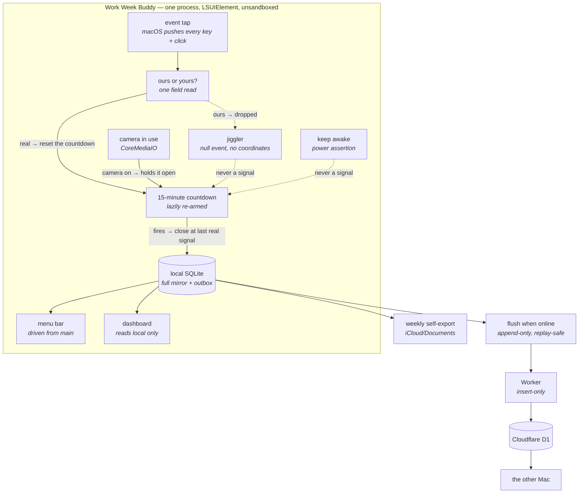

# Architecture

Everything here was chosen against measured evidence on macOS 26.5.1 (build 25F80), arm64. Where a claim was measured, `docs/MACOS.md` has the output.

## 1. Shape

One Electron process. No dock icon. The renderer only exists while the dashboard window is open.



## 2. Stack

| Component | Version | Why |
|---|---|---|
| **Electron** | 43.4.1 | Its main process runs a real `CFRunLoop`, so the event tap is dispatched by Chromium's own pump — measured 597 real events with **no drain timer anywhere**. Plain Node has no main-thread CFRunLoop and would need a `CFRunLoopRunInMode` pump on an interval. |
| **koffi** | 3.1.5 | Calls macOS frameworks from TypeScript. `npm i koffi` → 2 packages in ~1s, no node-gyp, no compiler, prebuilt Node-API binary. Replaces the entire native layer. |
| **node:sqlite** | ships in Electron 43's Node 24.18.1 | Verified working unflagged. Deletes `better-sqlite3` **and** `electron-rebuild`. Total native dependency count for the app: **one** (koffi). |
| **electron-vite / vite** | 5.0.0 / 7.3.6 | electron-vite 5's peer range is `^5 \|\| ^6 \|\| ^7`. Vite 8 is out; **pinning to 7.3.6 is mandatory, not conservatism.** |
| **Cloudflare D1** | current | The only free candidate with **no inactivity pause of any kind**, plus 7-day Time Travel PITR always on. Free caps: 5M rows read/day, 100k written/day, 5 GB. This app writes ~10 rows/day. |
| **Cloudflare Worker + wrangler** | 4.124.0 | The only way to give the work Mac a credential that cannot drop a table. Also: D1 caps bound parameters at 100 per query, which would limit the raw REST path to 5 rows per request. |
| **electron-builder** | 26.15.3 | `mac: { target: dir }` emits a bare `.app` with no installer ceremony. |
| **React / react-activity-calendar / recharts / tailwindcss / shadcn** | 19.2.8 / 3.2.1 / 3.10.1 / 4.3.3 / 4.18.0 | `design/App.reference.tsx` already imports exactly these and contains **zero** Tauri imports. It ports as-is. |
| **vitest** | 4.1.11 | The interval machine is a pure reducer over timestamps-as-data, so a 15-minute test is arithmetic. |
| **Node (tooling only)** | 22.14.0 via `.nvmrc` | The machine default 22.1.0 is known-bad here. Electron embeds its own Node; koffi is Node-API, so ABI is irrelevant. |

**Deliberately not used:** `uiohook-napi` (its event payload has no source pid or userData, so it *structurally* cannot tell our jiggle from a human — fatal; also `uIOhook.stop()` hung past a 2-minute timeout in testing), `node-global-key-listener` (keyboard only, x86-only helper), `ffi-napi` (dead since 2021), `powerMonitor.getSystemIdleTime()` / `getSystemIdleState()` (both wrap the jiggle-polluted seconds-since-input API — **ESLint-banned**).

## 3. Detection

### 3.1 Registration — two silent-death traps

Both were reproduced. Both produce zero events with no error.

1. **Run-loop mode.** The tap's source must be added to `kCFRunLoopDefaultMode`. `kCFRunLoopCommonModes` alone yields **exactly 0 events**. Add it to **both** — Default so events flow, Common so it survives menu-tracking and modal nested modes.
2. **Mask verification.** A tap created without the keyboard permission returns non-NULL with the keyboard bits **silently stripped**. Assert the granted mask via `CGGetEventTapList` at boot; do not trust the create call.

A third mode *is* self-reporting: a slow callback triggers `kCGEventTapDisabledByTimeout`, which arrives as a callback with type `0xFFFFFFFE`. Handle it before any field read, then `CGEventTapEnable(tap, true)`.

### 3.2 The countdown

Lazily re-armed. Armed only while an interval is open. On fire, recompute `lastRealSignalMs + timeout - now()`; re-arm if positive, close if not.

**The deadline lives in the main process as an absolute epoch-ms value** — never as a duration, and never in the renderer. Measured footgun: a chained `setTimeout` in a hidden renderer collapsed to 153 of 400 expected ticks, with a clean 60,000 ms gap.

### 3.3 Interval end timestamps

Taken from `CGEventGetTimestamp` on the event itself — nanoseconds since boot, exact — never from `Date.now()` at receipt. Verified: with a deliberately abusive 3-second drain, events queued losslessly in the mach port and their timestamps were still correct.

### 3.4 Sleep, wake, lock, crash

No tick is involved in any of them.

- **Sleep/wake:** the timer does not run while suspended. When it fires late it compares wall-clock and closes at `lastRealSignalMs`. `powerMonitor` `resume` also calls `flush()` and re-evaluates the deadline.
- **Lock:** does not close an interval. The countdown handles it, matching Slack.
- **Crash:** the open interval is journaled to a single-row table on every signal batch. On launch, it is resumed if still fresh, or closed at `last_signal_ms` with `end_reason='crash_recovered'`.

### 3.5 Residual polling, stated plainly

**There is exactly one timer that is not the countdown: the read-only sanity tick.** It posts nothing. It beats every **2 seconds** and does two different jobs on that one timer:

| Cadence | What it reads | Cost |
|---|---|---|
| every 2 s | `CGEventTapIsEnabled` — and `reviveTap()` if it says no | 15.6 µs × 43,200/day = **0.67 s CPU/day** |
| every 5 min | the full probe: camera, mic, granted mask, clock re-anchor | ~20 µs × 288/day = ~6 ms CPU/day |

It exists because **none** of the tap-death modes is reliably self-reporting, and because **an active liveness probe is impossible**: measured, even a `kCGEventNull` canary resets `HIDIdleTime`, so a periodic self-probe would double as an always-on jiggler. The watchdog must therefore be a passive read.

The tick used to run only every five minutes, and that is what made the app measure nothing. `kCGEventTapDisabledByTimeout` was assumed to announce itself; measured on real hardware, macOS disabled the tap and delivered **no notice at all** (docs/MACOS.md §1). Five minutes of invisible input is a lost session — the owner's database was five rows, none longer than six minutes, the two most recent ending `tap_lost`. Splitting the cheap read out of the expensive one is what makes a 2-second cadence affordable; the HAL walk over the CoreMediaIO and CoreAudio device lists stays at five minutes because it is the part that could block.

Nothing else in the system samples "seconds since last input" as a detection mechanism.

| Timer | Exists when | Does what |
|---|---|---|
| The countdown | an interval is open | ~1 op per 15 min at any input rate |
| Stall watch | always | 1 Hz heartbeat; reports its own gap when the main thread was held |
| Flush backoff | pending rows > 0 | drains to zero and stops; a failed fetch is the network signal |
| Tray refresh | popover open | UI only |
| Jiggler | user switched it on | posts a null event every 30 s |

## 4. Excluding our own jiggle

```ts
// posting
CGEventSourceSetUserData(src, 0x57574B31n);   // stamp before posting
// receiving
const isOurs = readField(ev, kCGEventSourceUserData /*42*/) === 0x57574B31
            && readField(ev, kCGEventSourceUnixProcessID /*41*/) === process.pid;
```

Two independent discriminators. Real HID events return `userData=0, srcPid=0`; ours return the magic and our pid. Measured clean across 422 events.

**`kCGEventSourceStateID` is NOT a discriminator** — a `HIDSystemState` source reads back `1`, identical to real input. And read the field as a number, not a BigInt literal comparison: getting that wrong misclassifies our jiggle as human input and inflates hours with fake time while throwing nothing.

**The jiggler must post to the same tap location the tap listens at**, or the jiggle is invisible to our own filter and the tap sees nothing to filter.

## 5. Sync

The **local mirror is the outbox** — there is no separate queue. Closed intervals are written locally with `synced_at_ms = NULL` and are never deleted.

`flush()` is called on interval close, on `resume`, on launch, and on backoff retry. It is single-flight, backs off 30s → 15min with ±20% jitter, and the backoff timer only exists while pending > 0.

**The critical rule: never mark `synced_at_ms` before the HTTP 200 returns, and key on *presence*, not on what the INSERT reported.** If a response is lost after the server committed, the retry re-sends identical ids, `ON CONFLICT DO NOTHING` no-ops, and the presence query still reports them. Every partial failure is replayable.

**Pull** (launch, wake, after each successful flush): `GET /intervals?since=<watermark - 200>` → `INSERT OR IGNORE` → page until empty → advance to `MAX(seq)`. **The 200-row overlap is not optional** — a strict `seq > watermark` can permanently skip a row when identity values become visible out of order. There is a test for exactly this.

Details, including why there are no conflicts, are in `docs/DATA_MODEL.md`.

## 6. Build, sign, install

**No Apple Developer account, no notarization.** A locally built `.app` carries no quarantine attribute, so Gatekeeper never engages.

**The one real cost of not paying, and its fix:** ad-hoc signatures produce a new code identity on every build, so the permission grants reset each rebuild. Fix: one **self-signed certificate with a stable designated requirement**, generated once and imported on both Macs. Both Macs must share the same leaf certificate.

> **Do not** use the `Apple Development: …` certificate already in the keychain. It is an employer team identity and it expires.

```
1. nvm use 22.14.0 && npm ci
2. npm run build
3. codesign --force --deep --sign "WWT Local Signing" "Work Week Buddy.app"
4. cp -R to /Applications          # always this exact path; the grant binds to it
5. --selftest                      # HARD GATE: tagged jiggle round-trips as ours
6. install the LaunchAgent
7. doctor                          # must print all-green before install exits
```

**Two TCC traps to pre-empt:**

1. **Dev and prod are different apps to macOS.** In `npm run dev` the subject is Electron's own bundle; packaged it is `com.bpotter.workweekbuddy`. Independent grants. Expect "works in dev, silently dead when packaged" exactly once.
2. **The grant binds to bundle id + designated requirement + on-disk path.** Freeze the bundle id before the first grant.

## 7. Dashboard

Port `design/App.reference.tsx` essentially unchanged. Three required fixes:

- `import "react-activity-calendar/tooltips.css"` — otherwise tooltips render unstyled
- pass `colorScheme={resolvedTheme}` explicitly — the component follows `prefers-color-scheme` while the app follows a class, so system and app can disagree
- serve the renderer over a custom `app://` protocol, not `file://` — Vite emits ESM, which Electron cannot load over `file://`

Also: CSP needs `style-src 'unsafe-inline'` (Recharts and @floating-ui write inline styles), every number gets `tabular-nums` or the layout jitters, and the window needs `minWidth: 880` because the 53-week heatmap is ~745 px and does not shrink — wrap it in `overflow-x-auto`.

Screenshot the **built app**, not `npm run dev` in a browser.
