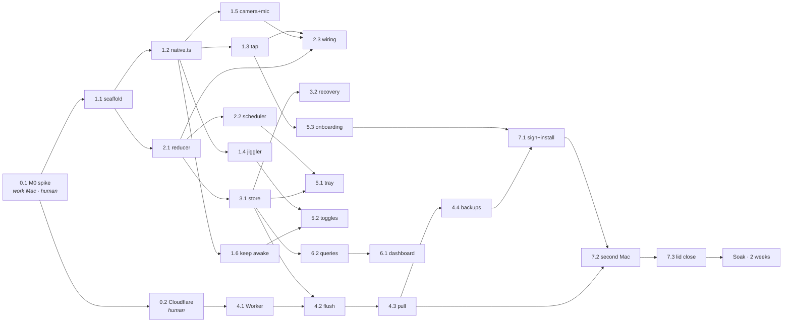

# The 24 tasks, expanded

`docs/TASKS.md` names the work. `docs/ROADMAP.md` names the gates. **This file says what to type.**

Every task below is a self-contained brief: exact file paths, the interfaces to implement, one command that proves it, the tests by name, and which of `AGENTS.md`'s 13 silent failures can bite *this* task. An agent that reads its own brief plus the docs it references should never need to ask a question.

**Read first, always:** `AGENTS.md`, then `docs/NON_GOALS.md`. Then your task's brief.

---

## 0. How to use this document

| If you are… | Read |
|---|---|
| An agent assigned one task | §2 (conventions), §3 (interface index), your task's brief, then the IMPL doc your brief names |
| The orchestrator | §5 (execution order) and §6 (project done) |
| A reviewer | §6, then the Traps line of every touched task |

**A task is not done until its gate passes.** Not "the code looks right", not "the tests pass" — the gate command in the brief runs and prints what the brief says it prints.

---

## 1. Vocabulary, fixed

| Term | Means exactly |
|---|---|
| **real signal** | A keyboard or mouse event that passed the ours-vs-theirs filter, or a camera/mic-meeting level edge. Never a jiggle, never a toggle, never UI interaction. |
| **last real signal** | `max(lastRealInputMs, lastLevelEvidenceMs)` — see `endTimestamp()` in §T2.1. This is what an interval ends at. |
| **level** | Camera-in-use, mic-in-use. A state, not an event. Converted to edges by the source adapters. |
| **edge** | A transition of a level, synthesized into a `Signal` with a timestamp. |
| **deadline** | An **absolute epoch-ms** number living in the main process. Never a duration. Never in the renderer. |
| **homogeneous interval** | `jiggler_s` is `0` or exactly `duration_s`. Guaranteed by construction, not by accumulation. |
| **gate** | A script whose stdout contains `GATE <id> PASS` for every check and which exits `0`. |

---

## 2. Conventions that bind every task

These remove the choices that would otherwise diverge between agents. They are not suggestions.

### 2.1 Time

- **All timestamps in `src/core/` and in the database are epoch milliseconds, UTC, `number`.** Suffix every such field `Ms`.
- Seconds only appear in stored columns that `docs/DATA_MODEL.md` declares as seconds; suffix those `S`.
- `src/core/` **never calls `Date.now()`.** Time enters the reducer as `input.atMs`. This is what makes a 15-minute test arithmetic.
- Mach → epoch conversion lives in exactly one place: `src/main/native/clock.ts`. See §T1.3.

### 2.2 Error handling — two categories, no third

```ts
// src/main/degrade.ts
export type DegradeCode =
  | 'keyboard_mask_missing'   // trap 2/3 — tap alive, keyboard bits stripped
  | 'tap_lost'                // trap 1/13 — tap disabled, recreated
  | 'accessibility_denied'    // CGEventPost would no-op
  | 'mic_prompted'            // M1 gate (g) failed: mic needed a permission
  | 'jiggle_unfiltered'       // trap 4/5/6 — self-test round-trip failed
  | 'fingerprint_mismatch'
  | 'sync_silent_72h'
  | 'db_unavailable';

export interface Degradation { code: DegradeCode; sinceMs: number; detail: Record<string, unknown> }

export function degrade(code: DegradeCode, detail: Record<string, unknown>): void;
export function recover(code: DegradeCode): void;
export function active(): Degradation[];
export function onChange(fn: (d: Degradation[]) => void): () => void;
```

- **Programmer error → `throw`.** A wrong koffi signature, a non-monotonic input, a missing column. Crash loudly in dev; the crash journal in §T3.2 recovers the interval.
- **Environment failure the user must see → `degrade(code, detail)`.** It persists to `sync_state` under key `degradations`, turns the tray icon red, and shows the renderer banner (§T5.3).
- **There is no third category.** No `catch { console.warn() }` followed by continuing. A swallowed error in this app is a wrong number, and a wrong number is the only failure that matters.

### 2.3 Module boundaries

| Directory | May import | May **not** import |
|---|---|---|
| `src/core/` | nothing but other `src/core/` files and `node:` type-only | `electron`, `koffi`, `node:sqlite`, anything with I/O |
| `src/main/native/` | `koffi`, `src/core/` types | `electron` UI modules, `src/renderer/` |
| `src/main/**` | everything main-side | `src/renderer/` |
| `src/renderer/` | React + `window.wwb` | `electron`, `node:*`, `src/main/` |
| `src/shared/` | nothing (types only) | everything |

Enforced by `eslint no-restricted-imports` in §T1.1, with a fixture proving each rule fires.

### 2.4 Naming

- Files: `kebab-case.ts`. Types: `PascalCase`. Functions: `camelCase`. Constants: `SCREAMING_SNAKE`.
- No default exports except React components.
- No `any`. `unknown` + a narrowing function. `koffi` returns are typed at the boundary in `native.ts` and never leak untyped.
- Discriminated unions use the key `kind`, always.

### 2.5 Testing

- `vitest` 4.1.11. `test/core/**` runs in the `node` environment with **zero** mocks — the reducer is pure.
- Fakes live in `test/fakes/`, never inline: `fake-clock.ts`, `fake-signal-source.ts`, `fake-sync-client.ts`, `seed-db.ts`.
- Every test name is a **sentence stating the invariant**, not `works correctly`.
- Property tests use `fast-check` (dev dependency, allowed — no native code).

### 2.6 Gate script protocol

Every gate script prints one line per check and nothing else on stdout:

```
GATE m1.a PASS  granted mask 0x...F0C includes keyDown|keyUp|flagsChanged
GATE m1.b FAIL  no real event within 60000ms
```

Exit code = number of `FAIL` lines. `scripts/gate/lib.sh` provides `gate_pass <id> <msg>` / `gate_fail <id> <msg>`.

### 2.7 The app's own CLI

Defined in §T1.1, used by half the gates:

| Flag | Does |
|---|---|
| `--selftest` | Boot assertions + tagged-jiggle round trip. JSON to stdout, exit 0/1. **Hard gate in `install.sh`.** |
| `--doctor` | Permissions, tap mask, db, sync watermark, degradations. Human-readable, exit 0 if all green. |
| `--gate <id>` | Runs one on-device probe (e.g. `--gate m1.d`). JSON, exit 0/1. |
| `--headless` | No tray, no window. Combined with the above. |

---

## 3. Interface index

Symbols are **owned** by the doc listed. This file reproduces signatures for locality; if the two ever disagree, the owning doc wins and this file gets fixed.

| Symbol | File | Owned by |
|---|---|---|
| `reduce`, `State`, `Signal`, `Command`, `Effect`, `Config`, `ClosedInterval` | `src/core/reduce.ts`, `src/core/types.ts` | `IMPL_CORE.md` |
| `uuidv7`, `clampMonotonic`, `localDateOf` | `src/core/uuid.ts`, `src/core/time.ts` | `IMPL_CORE.md` |
| `DeadlineScheduler` | `src/main/scheduler.ts` | `IMPL_CORE.md` |
| `native` (every koffi declaration) | `src/main/native/native.ts` | `IMPL_NATIVE.md` |
| `EventTap`, `Jiggler`, `CameraWatch`, `MicWatch`, `KeepAwake`, `Permissions`, `machineId()` | `src/main/native/*.ts` | `IMPL_NATIVE.md` |
| `Watchdog` | `src/main/watchdog.ts` | `IMPL_NATIVE.md` |
| `openDb`, `migrate`, `insertClosed`, `pending`, `markSynced`, `upsertFromCloud`, journal fns | `src/main/store/*.ts` | `IMPL_STORE_SYNC.md` |
| `SyncClient`, `flush`, `pull`, `fingerprintLocal`, `weeklyBackup` | `src/main/sync/*.ts` | `IMPL_STORE_SYNC.md` |
| `DashboardData` and the six query fns | `src/main/store/queries.ts` | `IMPL_STORE_SYNC.md` |
| `IpcApi`, `WireRow`, `CloudRow`, `ToggleState`, `PermissionState` | `src/shared/*.ts` | `IMPL_LAYOUT.md` |
| Tray, window, renderer components | `src/main/tray.ts`, `src/renderer/**` | `IMPL_UI.md` |
| Repo layout, tsconfigs, build, lint rules | — | `IMPL_LAYOUT.md` |

---

# 4. The 24 briefs

---

## Wave 0 — the go/no-go

### T0.1 · Run the M0 spike on the work Mac

**Depends on:** nothing. **Blocks:** everything.

**Files**
- `spike/run-m0.sh` — exists, do not rewrite
- `spike/RESULT-<hostname>-<YYYY-MM-DD>.txt` — created (the captured transcript)

**What to do**
1. On the **work** Mac: `./spike/run-m0.sh --checks-only` first. Read the output. It prompts for nothing.
2. Then `./spike/run-m0.sh` and click through both System Settings panes when they open.
3. `tee` the whole transcript into `spike/RESULT-<hostname>-<date>.txt` and commit it.
4. Record the verdict in the PR body: **GO**, **NO-GO**, or **INCONCLUSIVE**.

**Definition of done**

```bash
./spike/run-m0.sh 2>&1 | tee "spike/RESULT-$(scutil --get ComputerName)-$(date +%F).txt"
echo "exit=${PIPESTATUS[0]}"
```

Expect `exit=0` and, in section 3, a line confirming the granted tap mask **includes the keyboard bits**. Exit `1` = NO-GO: stop the project and re-scope. Exit `2` = inconclusive: install Xcode CLT (`xcode-select --install`) and re-run — do **not** treat 2 as a pass.

**Tests to write** — none. This is an observation, not code.

**Traps** — #2 in advance: the spike exists precisely because a tap comes back non-NULL with keyboard bits silently stripped. If section 3 prints a mask without `keyDown|keyUp|flagsChanged`, that is the NO-GO, regardless of what System Settings shows as toggled on.

**Size** — small · **requires the work Mac.** Cannot be faked, cannot be done on the personal Mac, and its answer is the premise of every other task.

---

### T0.2 · Cloudflare: D1 database, Worker skeleton, per-machine secrets

**Depends on:** 0.1. **Blocks:** 4.1.

**Files created**
- `worker/wrangler.toml`
- `worker/src/index.ts` — health route only at this stage
- `worker/schema.sql` — the cloud half of `docs/DATA_MODEL.md`, verbatim
- `worker/package.json`, `worker/tsconfig.json`
- `docs/CLOUD_SETUP.md` — the exact commands that were run, with ids redacted

**What to implement**

```toml
# worker/wrangler.toml
name = "wwb-sync"
main = "src/index.ts"
compatibility_date = "2026-08-01"
[[d1_databases]]
binding = "DB"
database_name = "wwb"
database_id = "<from wrangler d1 create>"
```

```ts
// worker/src/index.ts  (skeleton — 4.1 fills in the rest)
export interface Env { DB: D1Database; TOKEN_PERSONAL: string; TOKEN_WORK: string }

export default {
  async fetch(req: Request, env: Env): Promise<Response> {
    const url = new URL(req.url);
    if (req.method === 'GET' && url.pathname === '/health') {
      return Response.json({ ok: true, ms: Date.now() });
    }
    return new Response('not found', { status: 404 });
  },
} satisfies ExportedHandler<Env>;
```

Human steps, in order: `wrangler login` → `wrangler d1 create wwb` → paste the id into `wrangler.toml` → `wrangler d1 execute wwb --remote --file=worker/schema.sql` → `wrangler deploy` → `wrangler secret put TOKEN_PERSONAL` and `wrangler secret put TOKEN_WORK` with two independently generated 32-byte random strings (`openssl rand -base64 32`).

**The secrets are never written to a file in this repo.** They go straight from `openssl` into `wrangler secret put`, and into each Mac's Keychain via §T4.2's `token.ts`.

**Definition of done**

```bash
curl -s -o /dev/null -w '%{http_code}\n' https://wwb-sync.<subdomain>.workers.dev/health   # → 200
wrangler d1 execute wwb --remote --command "SELECT name FROM sqlite_master WHERE type='table' ORDER BY 1"
```

Expect `200` **run from both Macs**, and the table list `machine, work_interval` (plus `sqlite_sequence`).

**Tests to write** — none yet; 4.1 brings `worker/test/`.

**Traps** — none of the 13 apply. The one hazard is human: a secret pasted into a shell that has history enabled. Use `wrangler secret put` interactively and let it read stdin.

**Size** — small · **needs a real network on both Macs** (proving the work Mac's proxy allows `workers.dev` is half the point).

---

## Wave 1 — scaffold and the native layer

### T1.1 · Scaffold, lint rules, app CLI

**Depends on:** 0.1. **Blocks:** everything in `src/`.

**Files created**
```
.nvmrc                      22.14.0
package.json
tsconfig.json  tsconfig.node.json  tsconfig.web.json
electron.vite.config.ts
electron-builder.yml
eslint.config.js
vitest.config.ts
scripts/gate/lib.sh
src/main/index.ts
src/main/cli.ts
src/main/degrade.ts
src/preload/index.ts
src/renderer/index.html  src/renderer/main.tsx  src/renderer/App.tsx
src/shared/ipc-contract.ts
src/core/index.ts            (empty barrel; 2.1 fills it)
test/lint-fixtures/*.ts      deliberate violations, one per rule
```

**What to implement**

- Exact versions from `docs/ARCHITECTURE.md` §2. **Vite pinned to `7.3.6`** (`"vite": "7.3.6"`, no caret). electron-vite `5.0.0`. Electron `43.4.1`. koffi `3.1.5`. No `better-sqlite3`, no `electron-rebuild`.
- `app.dock.hide()` + `LSUIElement: true` in `electron-builder.yml` under `mac.extendInfo`. Bundle id **`com.bpotter.workweekbuddy`, frozen now** — changing it later resets every TCC grant.
- `mac.target: dir`, `mac.hardenedRuntime: true`, and **no `com.apple.security.app-sandbox` entitlement anywhere** (trap 12).
- The renderer is served over a custom `app://` protocol (`protocol.handle`), never `file://` — Vite emits ESM and Electron cannot load ESM over `file://`.
- `webPreferences: { contextIsolation: true, nodeIntegration: false, sandbox: true }`. **The Chromium renderer sandbox stays ON.** The thing that is banned is the macOS App Sandbox *entitlement*; they are unrelated, and confusing them either breaks the renderer's isolation or kills camera detection.

`eslint.config.js` must carry all four rule families, each with a fixture proving it fires:

```js
// eslint.config.js (excerpt)
rules: {
  'no-restricted-properties': ['error',
    { object: 'powerMonitor', property: 'getSystemIdleTime',
      message: 'Polluted by CGEventPost. Use lastRealSignalMs.' },
    { object: 'powerMonitor', property: 'getSystemIdleState',
      message: 'Polluted by CGEventPost. Use lastRealSignalMs.' },
  ],
  'no-restricted-syntax': ['error',
    { selector: "CallExpression[callee.name='CGEventSourceSecondsSinceLastEventType']",
      message: 'Polluted by CGEventPost. Use lastRealSignalMs.' },
    { selector: "Literal[value=/HIDIdleTime/]",
      message: 'Polluted by CGEventPost. Use lastRealSignalMs.' },
    { selector: "Literal[value=/kCGEventSourceStatePrivate/]",
      message: 'Blocks forever on macOS 26.5.1. Never call it.' },
  ],
}
```

plus a `files: ['src/core/**']` override with `'no-restricted-imports': ['error', { patterns: ['electron', 'electron/*', 'koffi', 'node:sqlite', '**/main/**'] }]`.

`src/main/cli.ts` parses the four flags from §2.7 and dispatches before `app.whenReady()` where possible.

**Definition of done**

```bash
nvm use && npm ci && npm run typecheck && npm run lint && npm run build
npx eslint test/lint-fixtures --no-ignore     # must report exactly 6 errors, one per fixture
codesign -d --entitlements - "out/mac-arm64/Work Week Buddy.app" 2>&1 | grep -c app-sandbox   # → 0
open "out/mac-arm64/Work Week Buddy.app"
```

Expect: `typecheck` and `lint` clean on `src/`; the fixture run failing with **one error per banned pattern**, each printing its custom message; `grep -c` printing `0`; the built app appearing as a **menu-bar icon with no Dock icon and no window**.

**Tests to write**

| File | Name |
|---|---|
| `test/lint-fixtures/README.md` | (documents that these files are *supposed* to fail lint) |
| `test/scaffold/cli.test.ts` | `parses --selftest --headless into {selftest:true, headless:true}` |
| `test/scaffold/cli.test.ts` | `rejects an unknown flag with exit code 2 rather than ignoring it` |
| `test/scaffold/degrade.test.ts` | `degrade() is idempotent and keeps the original sinceMs` |
| `test/scaffold/degrade.test.ts` | `recover() removes only the named code` |
| `test/scaffold/lint-rules.test.ts` | `every banned API has a lint fixture that actually fails` |

**Traps** — #7 (the lint rules are the mitigation; if a fixture does not fail, the rule is decorative), #12 (no App Sandbox entitlement — the `codesign` grep is the gate), #10 (the scaffold must not create any renderer timer).

**Size** — medium · **fakes only.** Any Mac.

---

### T1.2 · `native.ts` — every koffi declaration, in one file

**Depends on:** 1.1. **Blocks:** 1.3, 1.4, 1.5, 1.6.

**Files created**
- `src/main/native/native.ts` — **the only file in the repo that calls `koffi.load` or `koffi.func`**
- `src/main/native/constants.ts` — event types, field numbers, masks, the magic number
- `src/main/native/clock.ts` — mach → epoch conversion (see T1.3)
- `test/native/boot.test.ts` — exercises every declaration once, under Electron

**What to implement**

One module, ~45 declarations, grouped by framework, each with a one-line comment naming its header:

```ts
import koffi from 'koffi';

const CG  = koffi.load('/System/Library/Frameworks/CoreGraphics.framework/CoreGraphics');
const CF  = koffi.load('/System/Library/Frameworks/CoreFoundation.framework/CoreFoundation');
const CM  = koffi.load('/System/Library/Frameworks/CoreMediaIO.framework/CoreMediaIO');
const CA  = koffi.load('/System/Library/Frameworks/CoreAudio.framework/CoreAudio');
const IOK = koffi.load('/System/Library/Frameworks/IOKit.framework/IOKit');
const AX  = koffi.load('/System/Library/Frameworks/ApplicationServices.framework/ApplicationServices');

// ── opaque pointers ────────────────────────────────────────────────────────
export const CFMachPortRef      = koffi.pointer('CFMachPortRef',      koffi.opaque());
export const CFRunLoopSourceRef = koffi.pointer('CFRunLoopSourceRef', koffi.opaque());
export const CGEventRef         = koffi.pointer('CGEventRef',         koffi.opaque());
export const CGEventSourceRef   = koffi.pointer('CGEventSourceRef',   koffi.opaque());

// CGEventRef (*)(CGEventTapProxy, CGEventType, CGEventRef, void *)
export const CGEventTapCallBack = koffi.proto(
  'CGEventRef CGEventTapCallBack(void *proxy, uint32_t type, CGEventRef event, void *userInfo)');

export const CGEventTapCreate = CG.func(
  'CFMachPortRef CGEventTapCreate(uint32_t tap, uint32_t place, uint32_t options,'
  + ' uint64_t eventsOfInterest, CGEventTapCallBack *callback, void *userInfo)');

export const CGEventGetTimestamp = CG.func('uint64_t CGEventGetTimestamp(CGEventRef e)');
export const CGEventGetIntegerValueField =
  CG.func('int64_t CGEventGetIntegerValueField(CGEventRef e, uint32_t field)');
export const CGEventTapEnable    = CG.func('void CGEventTapEnable(CFMachPortRef tap, bool enable)');
export const CGEventTapIsEnabled = CG.func('bool CGEventTapIsEnabled(CFMachPortRef tap)');
// … CGEventSourceCreate, CGEventSourceSetUserData, CGEventCreate, CGEventSetType,
//    CGEventPost, CFMachPortCreateRunLoopSource, CFRunLoopAddSource, CFRunLoopGetMain,
//    CGGetEventTapList, CGPreflightListenEventAccess, CGRequestListenEventAccess,
//    CGPreflightPostEventAccess, CGRequestPostEventAccess, AXIsProcessTrusted,
//    CMIOObjectGetPropertyData / …DataSize, AudioObjectGetPropertyData / …DataSize,
//    IOPMAssertionCreateWithName, IOPMAssertionRelease,
//    IORegistryEntryFromPath, IORegistryEntryCreateCFProperty, CFStringGetCString,
//    mach_absolute_time, mach_timebase_info
```

Rules for this file, and they are absolute:

- **Every declaration is exercised exactly once by `test/native/boot.test.ts`.** koffi prototypes are string-typed; a wrong signature is a segfault, not a compile error. The boot test is the only compiler this file gets.
- **`CGEventGetIntegerValueField` returns `int64_t`, and koffi hands it back as a JS `number`.** Declare it `int64_t`, never compare its result to a `BigInt` literal (trap 4), and route every field read through one helper that asserts the type:

```ts
export function eventField(ev: unknown, field: number): number {
  const v = CGEventGetIntegerValueField(ev, field);
  if (typeof v !== 'number') {
    throw new Error(
      `koffi returned ${typeof v} for field ${field}; the ours-vs-theirs comparison ` +
      `would be silently false and our own jiggle would count as human input`);
  }
  return v;
}
```

- Callback trampolines must be **retained on a module-level array** (`const RETAINED: unknown[] = []`) or V8 collects them and the tap dies with no error and no events.
- `kCGEventSourceStatePrivate` is **not declared in this file at all.** A symbol that does not exist cannot be called (trap 11).
- `constants.ts` carries every number, named once:

```ts
export const kCGSessionEventTap = 1, kCGHeadInsertEventTap = 0, kCGEventTapOptionListenOnly = 1;
export const kCGEventSourceUnixProcessID = 41, kCGEventSourceUserData = 42;
export const kCGEventTapDisabledByTimeout = 0xFFFFFFFE, kCGEventTapDisabledByUserInput = 0xFFFFFFFF;
export const WWB_MAGIC = 0x57574B31;             // 'WWK1' — a number, never a BigInt literal
export const EVT = { leftMouseDown:1, leftMouseUp:2, rightMouseDown:3, rightMouseUp:4,
  mouseMoved:5, leftMouseDragged:6, rightMouseDragged:7, keyDown:10, keyUp:11,
  flagsChanged:12, scrollWheel:22, tabletPointer:23, tabletProximity:24,
  otherMouseDown:25, otherMouseUp:26, otherMouseDragged:27 } as const;
export const KEYBOARD_BITS = (1n << 10n) | (1n << 11n) | (1n << 12n);
export const TAP_MASK =
  (1n<<1n)|(1n<<2n)|(1n<<3n)|(1n<<4n)|(1n<<6n)|(1n<<7n)|
  KEYBOARD_BITS|(1n<<22n)|(1n<<25n)|(1n<<26n)|(1n<<27n);
```

`mouseMoved` (5) is **deliberately excluded** from `TAP_MASK`: clicks, drags and scroll are ample evidence of a human, and excluding move takes the worst-case callback rate from ~300/s to ~20/s. Say so in a comment; do not re-add it.

**Definition of done**

```bash
npm run test:native      # electron-vite build, then electron --headless running the boot test
```

Expect no segfault and stdout ending:

```
GATE 1.2 PASS  45/45 koffi declarations exercised, 0 segfaults
```

**Tests to write**

| File | Name |
|---|---|
| `test/native/boot.test.ts` | `every exported koffi declaration is invoked at least once without crashing` |
| `test/native/boot.test.ts` | `eventField returns a JS number, not a BigInt` |
| `test/native/boot.test.ts` | `TAP_MASK contains keyDown, keyUp and flagsChanged` |
| `test/native/boot.test.ts` | `TAP_MASK does not contain mouseMoved` |
| `test/native/boot.test.ts` | `WWB_MAGIC is a number and equals 0x57574B31` |
| `test/native/boot.test.ts` | `kCGEventSourceStatePrivate is not exported from native.ts` |
| `test/native/boot.test.ts` | `callback trampolines are retained on a module-level array` |

**Traps** — #4 (the `typeof` assertion lives here, not in the caller), #11 (absent by construction), #3 (the mask constant is defined here once and asserted here).

**Size** — medium · **requires a real Mac.** koffi loads real frameworks; there is nothing to fake.

---

### T1.3 · The event tap — create, register, assert the mask, survive being disabled

**Depends on:** 1.2. **Blocks:** 2.3, 5.3.

**Files created**
- `src/main/native/tap.ts`
- `src/main/native/clock.ts`
- `src/main/watchdog.ts` — **the one and only extra timer in the app**
- `scripts/gate/m1.sh`
- `test/native/tap.test.ts`, `test/native/clock.test.ts`

**What to implement**

```ts
// src/main/native/tap.ts
export interface RealEvent { kind: 'key' | 'mouse'; atMs: number; type: number }

export interface EventTap {
  /** Granted mask read back from CGGetEventTapList — NOT the mask we requested. */
  readonly grantedMask: bigint;
  readonly enabled: boolean;
  start(): void;
  stop(): void;
  /** Called for every event that survived the ours-vs-theirs filter. */
  onReal(fn: (e: RealEvent) => void): () => void;
  /** Called when the tap was found disabled and was re-enabled or recreated. */
  onLost(fn: (why: 'timeout' | 'userInput' | 'watchdog') => void): () => void;
}

export function createEventTap(): EventTap;
```

Order of operations inside `createEventTap`, and it is not negotiable:

1. `CGEventTapCreate(kCGSessionEventTap, kCGHeadInsertEventTap, kCGEventTapOptionListenOnly, TAP_MASK, cb, null)`.
2. `CFMachPortCreateRunLoopSource`, then **`CFRunLoopAddSource` twice** — once with `kCFRunLoopDefaultMode`, once with `kCFRunLoopCommonModes`. Default so events flow at all; Common so the tap survives menu tracking and modal nested run-loop modes. **Common alone yields exactly 0 events, silently** (trap 1).
3. `CGEventTapEnable(tap, true)`.
4. Read the **granted** mask back with `CGGetEventTapList`, matching on our own pid, and assert `(granted & KEYBOARD_BITS) === KEYBOARD_BITS`. If not: `degrade('keyboard_mask_missing', { granted: granted.toString(16) })` and keep running — mouse and camera still work (traps 2 and 3).

The callback, with the ordering that matters:

```ts
const cb = (proxy: unknown, type: number, ev: unknown): unknown => {
  // 1. DISABLE NOTICES FIRST. On these two types the event carries no fields and
  //    reading one gives garbage (trap 13).
  if (type === kCGEventTapDisabledByTimeout || type === kCGEventTapDisabledByUserInput) {
    CGEventTapEnable(tapPort, true);
    emitLost(type === kCGEventTapDisabledByTimeout ? 'timeout' : 'userInput');
    return ev;
  }
  // 2. Ours or theirs — two independent discriminators, both read as numbers.
  const userData = eventField(ev, kCGEventSourceUserData);
  const srcPid   = eventField(ev, kCGEventSourceUnixProcessID);
  if (userData === WWB_MAGIC && srcPid === process.pid) return ev;   // our jiggle: dropped
  // 3. Timestamp comes off the EVENT, never Date.now().
  const atMs = machToEpochMs(CGEventGetTimestamp(ev));
  emitReal({ kind: type === EVT.keyDown || type === EVT.keyUp || type === EVT.flagsChanged
    ? 'key' : 'mouse', atMs, type });
  return ev;                                       // listen-only: always return the event
};
```

**Do not do work in this callback.** Measured budget is 1.6 µs; a 1.6-second block gets the tap disabled by the OS. Push the `RealEvent` onto a queue and let the wiring layer (§T2.3) coalesce.

```ts
// src/main/native/clock.ts
let bootEpochMs = 0;
export function calibrateClock(): void {
  const t = machTimebase();                       // numer/denom, 1/1 on arm64
  const machNowMs = Number(mach_absolute_time()) * t.numer / t.denom / 1e6;
  bootEpochMs = Date.now() - machNowMs;
}
export function machToEpochMs(machNs: bigint | number): number {
  return Math.round(bootEpochMs + Number(machNs) / 1e6);
}
```

`calibrateClock()` runs at boot, on `powerMonitor` `resume`, and whenever the watchdog finds the derived clock more than 250 ms off `Date.now()`. **`mach_absolute_time` does not advance during sleep**, so skipping the resume recalibration back-dates every post-wake event by the length of the nap — a silent, plausible-looking error.

```ts
// src/main/watchdog.ts — exactly one setInterval in the whole application
export interface Probe { name: string; read(): void }   // read-only. Posts nothing. Ever.
export const Watchdog = {
  register(p: Probe): void,
  start(intervalMs = 5 * 60_000): void,
  stop(): void,
  runNow(): void,           // used by tests and by --gate
};
```

The tap registers a probe that reads `CGEventTapIsEnabled` and the granted mask. If the tap is disabled and cannot be re-enabled, recreate it and emit `onLost('watchdog')`; the wiring layer closes the open interval with `end_reason='tap_lost'` at the last real signal. **The probe must not post any event.** Even a `kCGEventNull` canary resets `HIDIdleTime`, which would make the watchdog an always-on jiggler.

**Definition of done**

```bash
npm run build && ./scripts/gate/m1.sh        # drives the built app, not npm run dev
```

Expect exactly:

```
GATE m1.a PASS  granted mask 0x...1c00 includes keyDown|keyUp|flagsChanged
GATE m1.b PASS  first real event 412ms after launch
GATE m1.d PASS  2000ms block produced type 0xFFFFFFFE, tap re-enabled, events resumed
GATE m1.e PASS  DefaultMode+CommonModes: 118 events · CommonModes only: 0 events
```

`m1.e` is an A/B inside `--gate m1.e`: it builds a second tap registered only in Common modes and asserts it receives **zero** events while the real one receives some. If both receive events, the assertion is not testing anything — fail the gate.

**Tests to write**

| File | Name |
|---|---|
| `test/native/tap.test.ts` | `asserts the granted mask rather than the requested mask` |
| `test/native/tap.test.ts` | `degrades with keyboard_mask_missing when keyboard bits are stripped` |
| `test/native/tap.test.ts` | `handles the disable notice before reading any event field` |
| `test/native/tap.test.ts` | `re-enables the tap after kCGEventTapDisabledByTimeout` |
| `test/native/tap.test.ts` | `drops events whose userData is WWB_MAGIC and whose pid is ours` |
| `test/native/tap.test.ts` | `keeps events with userData 0 and pid 0` |
| `test/native/clock.test.ts` | `machToEpochMs is monotonic across a simulated 2-hour sleep after recalibration` |
| `test/native/clock.test.ts` | `an uncalibrated clock never silently returns a timestamp` |
| `test/native/watchdog.test.ts` | `registers exactly one interval regardless of probe count` |
| `test/native/watchdog.test.ts` | `a probe that posts an event fails the read-only assertion` |

**Traps** — **#1** (both run-loop modes, A/B-asserted), **#2** and **#3** (granted-mask assertion), **#13** (disable notice handled before any field read), #4 and #5 by way of the filter living here.

**Size** — large · **requires a real Mac.** The A/B and the timeout-disable test cannot be faked.

---

### T1.4 · The jiggler — stamped null events, and the self-test that proves the filter works

**Depends on:** 1.2 (and 1.3 to observe the round trip). **Blocks:** 5.2.

**Files created**
- `src/main/native/jiggler.ts`
- `src/main/selftest.ts`
- `test/native/jiggler.test.ts`

**What to implement**

```ts
// src/main/native/jiggler.ts
export interface Jiggler {
  readonly on: boolean;
  /** Returns false and degrades if Accessibility is not granted — never silently no-ops. */
  start(): boolean;
  stop(): void;
  /** Post exactly one stamped null event. Used by the self-test. */
  poke(): void;
}
export function createJiggler(): Jiggler;
```

The post path, all four load-bearing details in six lines:

```ts
const src = CGEventSourceCreate(kCGEventSourceStateHIDSystemState /* 1 */);
CGEventSourceSetUserData(src, WWB_MAGIC);        // stamp BEFORE creating the event
const ev = CGEventCreate(src);
CGEventSetType(ev, 0 /* kCGEventNull */);        // no coordinates: cannot move the cursor
CGEventPost(kCGSessionEventTap /* 1 */, ev);     // SAME location the tap listens at (trap 6)
```

- **Interval: 30 s.** One `setInterval`, created on `start()`, cleared on `stop()`. It exists only while the user has the toggle on, so it is not a violation of "no polling".
- **Gate every post on `AXIsProcessTrusted()`.** `CGEventPost` fails silently without Accessibility — cursor delta 0, no error, no exception. A toggle that reads "on" and does nothing is the exact failure to design against. If untrusted: `degrade('accessibility_denied', {})`, return `false` from `start()`, and let §T5.2 show the tooltip.
- **`kCGEventSourceStateID` (field 45) is not a discriminator** — a HIDSystemState source reads back `1`, identical to real input (trap 5). The pair is `userData` + `pid`, and nothing else.
- The idle-clock reset is **asynchronous** — a read immediately after `CGEventPost` returns still shows the old value, then ~300 ms later shows ~0.3 s. Any test that samples must wait ≥500 ms.

```ts
// src/main/selftest.ts
export interface SelfTestResult {
  ok: boolean;
  checks: Array<{ id: string; ok: boolean; detail: string }>;
}
/**
 * Posts one stamped null event and asserts the tap identified it as OURS.
 * If this fails, the jiggler would inflate hours with fake time — so it is a
 * HARD GATE in install.sh and refuses to install.
 */
export async function runSelfTest(tap: EventTap, jig: Jiggler): Promise<SelfTestResult>;
```

Checks, by id: `mask_keyboard`, `tap_receiving`, `jiggle_identified_as_ours`, `jiggle_field_is_number`, `cursor_did_not_move`, `accessibility`, `mic_no_prompt`.

`cursor_did_not_move` reads `screen.getCursorScreenPoint()` before and after 3 pokes and asserts a delta of exactly `(0, 0)`.

**Definition of done**

```bash
npm run build && "out/mac-arm64/Work Week Buddy.app/Contents/MacOS/Work Week Buddy" --selftest
```

Expect JSON on stdout, exit 0:

```json
{"ok":true,"checks":[
  {"id":"jiggle_identified_as_ours","ok":true,"detail":"userData=0x57574b31 pid=59014 typeof=number"},
  {"id":"cursor_did_not_move","ok":true,"detail":"delta=(0,0) over 3 pokes"}]}
```

**Tests to write**

| File | Name |
|---|---|
| `test/native/jiggler.test.ts` | `a posted jiggle round-trips through the tap and is classified as ours` |
| `test/native/jiggler.test.ts` | `the userData field is read as a number, not a BigInt` |
| `test/native/jiggler.test.ts` | `comparing userData to a BigInt literal would misclassify — regression guard` |
| `test/native/jiggler.test.ts` | `three pokes move the cursor by exactly zero pixels` |
| `test/native/jiggler.test.ts` | `start() returns false and degrades when AXIsProcessTrusted is false` |
| `test/native/jiggler.test.ts` | `posts to kCGSessionEventTap, the same location the tap listens at` |
| `test/native/jiggler.test.ts` | `a jiggle never reaches the reducer as a signal` |
| `test/main/selftest.test.ts` | `runSelfTest fails closed when the round trip does not come back` |

The BigInt regression guard is worth writing explicitly: assert that `(0x57574B31 as unknown) === 0x57574B31n` is `false`, so the test file itself documents why the bug is invisible.

**Traps** — **#4** (BigInt comparison → 24-hour workdays), **#5** (`StateID` is not a discriminator), **#6** (same tap location), and #7 indirectly (the reason the watchdog cannot use a canary).

**Size** — medium · **requires a real Mac** and Accessibility granted.

---

### T1.5 · Camera and microphone in use, plus the meeting-app conjunction

**Depends on:** 1.2. **Blocks:** 2.3.

**Files created**
- `src/main/native/camera.ts`
- `src/main/native/mic.ts`
- `src/main/native/meeting-apps.ts`
- `src/main/config/meeting-apps.default.json`
- `test/native/camera.test.ts`, `test/native/mic.test.ts`, `test/core/mic-conjunction.test.ts`

**What to implement**

```ts
// src/main/native/camera.ts
export interface LevelWatch {
  readonly on: boolean;
  start(): void;
  stop(): void;
  /** Edges only. atMs is the moment the edge was observed. */
  onEdge(fn: (on: boolean, atMs: number) => void): () => void;
}
export function createCameraWatch(): LevelWatch;   // CoreMediaIO
export function createMicWatch(): LevelWatch;      // CoreAudio
```

- **Camera:** enumerate `kCMIOHardwarePropertyDevices` on `kCMIOObjectSystemObject`, read `kCMIODevicePropertyDeviceIsRunningSomewhere` per device, **OR across all of them** — this machine has a built-in and an external camera and reading only the first is a silent false negative.
- **Mic:** the exact mirror in CoreAudio — enumerate devices, read `kAudioDevicePropertyDeviceIsRunningSomewhere`, OR across **input** devices only.
- **Register the property listeners, but do not trust them.** `docs/MACOS.md` §4 is explicit: the listener registers with `OSStatus 0` and was **never observed firing**. Correctness is anchored on a re-read registered with `Watchdog` (§T1.3), so the worst case is ≤5 minutes of latency, not a lost signal. Both paths feed the same debounced edge emitter, and a listener-driven edge that the next re-read contradicts is discarded.
- The first CMIO connection powers the camera ISP for ~4 seconds. **Open the connection once at boot and keep it**; never open one per check.

```ts
// src/main/native/meeting-apps.ts
export interface MeetingAppRules { allow: string[]; ignore: string[] }   // bundle ids
export function loadRules(): MeetingAppRules;      // default json, overridable in app support
export function meetingAppRunning(rules: MeetingAppRules): boolean;      // NSRunningApplication
```

Seed `allow` with `us.zoom.xos`, `com.tinyspeck.slackmacgap`, `com.microsoft.teams2`, `com.cisco.webexmeetingsapp`, `com.hnc.Discord`, `com.google.Chrome`, `com.apple.Safari`, `com.brave.Browser`. Seed `ignore` with `com.wisprflow.flow`, `com.openwhispr.app`. Enumeration of running applications needs **no permission**.

The conjunction and the 60-second floor live in one place, and it is pure so it can be tested without a Mac:

```ts
// src/core/mic-gate.ts  — pure, no imports
export interface MicGateState { captureSinceMs: number | null; qualified: boolean }
export const MIC_MIN_CAPTURE_MS = 60_000;

/** Returns the qualified mic-meeting level, plus the edge to emit (or null). */
export function micGate(
  s: MicGateState,
  now: { atMs: number; capturing: boolean; meetingAppRunning: boolean },
): { state: MicGateState; edge: { on: boolean; atMs: number } | null } {
  const live = now.capturing && now.meetingAppRunning;
  if (!live) {
    return { state: { captureSinceMs: null, qualified: false },
             edge: s.qualified ? { on: false, atMs: now.atMs } : null };
  }
  const since = s.captureSinceMs ?? now.atMs;
  const qualified = now.atMs - since >= MIC_MIN_CAPTURE_MS;
  return { state: { captureSinceMs: since, qualified },
           edge: qualified && !s.qualified ? { on: true, atMs: now.atMs } : null };
}
```

**The qualifying edge is stamped at `now.atMs`, not back-dated to `captureSinceMs`.** Decision, taken here so nobody re-litigates it: back-dating would push a signal *behind* timestamps the reducer has already consumed and break the monotonic-input invariant that the property test in §T2.1 relies on. The cost is a deliberate ≤60-second undercount at the front of a mic-only meeting, which is a rounding error against a 15-minute timeout. Do not "improve" this.

**Definition of done**

```bash
npm run build && "…/Work Week Buddy.app/Contents/MacOS/Work Week Buddy" --gate m1.g
# then, while it runs: open Photo Booth, then quit it; start a Zoom test call, then leave it
```

Expect:

```
GATE m1.g PASS  mic read 40 times, TCC prompts observed: 0, tccd log rows for this bundle: 0
GATE m1.g PASS  camera level 0→1→0 bracketing an external capture
```

If a prompt appears, the gate must **FAIL loudly and say so** — `docs/MACOS.md` §4b flags this as expected-but-unverified, and shipping a silent first-launch mic prompt is the bad outcome. The gate greps `log show --predicate 'subsystem == "com.apple.TCC"' --last 2m` for our bundle id.

**Tests to write**

| File | Name |
|---|---|
| `test/core/mic-gate.test.ts` | `a 59-second capture with a meeting app running never qualifies` |
| `test/core/mic-gate.test.ts` | `a 61-second capture with a meeting app running qualifies exactly once` |
| `test/core/mic-gate.test.ts` | `mic capture without a meeting app running never qualifies` |
| `test/core/mic-gate.test.ts` | `losing the meeting app mid-capture emits an off edge` |
| `test/core/mic-gate.test.ts` | `restarting a capture restarts the 60-second clock` |
| `test/native/camera.test.ts` | `ORs the running flag across every enumerated device` |
| `test/native/camera.test.ts` | `holds one CMIO connection for the process lifetime` |
| `test/native/camera.test.ts` | `a listener edge contradicted by the next re-read is discarded` |
| `test/native/mic.test.ts` | `reading the mic level produces no TCC prompt` |
| `test/native/meeting-apps.test.ts` | `an ignore-list app alone does not satisfy the conjunction` |

**Traps** — #7 (this is where an agent is most tempted to reach for an idle API "to check if he's there"), #12 (App Sandbox returns zero CMIO devices — if the device count is 0 on a machine with a built-in camera, that is the symptom), and the `docs/MACOS.md` §8 unverified-listener caveat.

**Size** — medium · `src/core/mic-gate.ts` is **fakes-only**; the two watches **require a real Mac** plus a camera and a meeting app to toggle.

---

### T1.6 · Keep awake, via one power assertion

**Depends on:** 1.2. **Blocks:** 5.2.

**Files created**
- `src/main/native/awake.ts`
- `test/native/awake.test.ts`

**What to implement**

```ts
// src/main/native/awake.ts
export interface KeepAwake {
  readonly on: boolean;
  enable(): boolean;    // false if the assertion could not be created
  disable(): void;
}
export function createKeepAwake(): KeepAwake;
```

`IOPMAssertionCreateWithName` with **both** `PreventUserIdleSystemSleep` and `PreventUserIdleDisplaySleep`, named `"Work Week Buddy — keep awake"`, held in-process. `IOPMAssertionRelease` on `disable()`. The kernel releases it on process death, which is the whole reason for doing it in-process.

- Electron's `powerSaveBlocker` reaches the same API and is an acceptable implementation. If you use it, keep the same interface so the caller cannot tell.
- **Never** `spawn('/usr/bin/caffeinate')` — it orphans a child that outlives the app.
- **Toggling keep-awake is never a work signal.** It must not reach the reducer. There is no code path from `awake.ts` to `reduce()`, and the test below asserts that by construction.

**Definition of done**

```bash
npm run build && "…/Work Week Buddy.app/Contents/MacOS/Work Week Buddy" --gate m5.d
```

Expect:

```
GATE m5.d PASS  pmset -g assertions: 1 assertion named 'Work Week Buddy — keep awake'
GATE m5.d PASS  after release: 0 assertions with that name
```

**Tests to write**

| File | Name |
|---|---|
| `test/native/awake.test.ts` | `creates exactly one named assertion and releases it` |
| `test/native/awake.test.ts` | `enable() twice does not create a second assertion` |
| `test/native/awake.test.ts` | `disable() without enable() is a no-op, not a crash` |
| `test/native/awake.test.ts` | `no module imports reduce() from awake.ts` (source-level assertion) |

**Traps** — none of the 13 directly. The one to avoid is treating the toggle as activity; the last test is the guard.

**Size** — small · **requires a real Mac** (`pmset -g assertions` is the gate).

---

## Wave 2 — the interval machine

### T2.1 · The reducer — pure, timestamps as data

**Depends on:** 1.1. **Blocks:** 2.2, 2.3, 3.1, 5.2.

**Files created**
- `src/core/types.ts`, `src/core/reduce.ts`, `src/core/config.ts`, `src/core/time.ts`, `src/core/uuid.ts`, `src/core/index.ts`
- `test/core/reduce.*.test.ts`, `test/core/property.test.ts`

**What to implement**

```ts
// src/core/types.ts
export type Ms = number;    // epoch milliseconds, UTC

export type Signal =
  | { kind: 'key';   atMs: Ms; count: number }
  | { kind: 'mouse'; atMs: Ms; count: number }
  | { kind: 'camera';      atMs: Ms; on: boolean }
  | { kind: 'mic_meeting'; atMs: Ms; on: boolean };

export type Command =
  | { kind: 'deadline';  atMs: Ms }
  | { kind: 'jiggler';   atMs: Ms; on: boolean }
  | { kind: 'pause';     atMs: Ms; on: boolean }
  | { kind: 'lifecycle'; atMs: Ms; event: 'suspend' | 'resume' | 'shutdown' | 'app_quit' | 'tap_lost' }
  | { kind: 'resume_journal'; atMs: Ms; snapshot: OpenSnapshot };

export type Input = Signal | Command;

export interface OpenSnapshot {
  id: string; machineId: string;
  startedAtMs: Ms; lastRealInputMs: Ms; lastLevelEvidenceMs: Ms;
  keyEvents: number; mouseEvents: number;
  cameraAccumMs: number; cameraSinceMs: Ms | null;
  levelSinceMs: Ms | null;      // camera OR mic_meeting currently held, since when
  jigglerOn: boolean;
  suspendedSinceMs: Ms | null;  // a 'suspend' seen while this interval was open
}

export interface State {
  open: OpenSnapshot | null;
  cameraOn: boolean; micMeetingOn: boolean;
  jigglerOn: boolean; paused: boolean;
  lastInputMs: Ms;              // monotonicity guard for the whole stream
}

export interface ClosedInterval {
  id: string; machineId: string;
  startedAtMs: Ms; endedAtMs: Ms; durationS: number;
  endReason: 'idle_timeout' | 'sleep' | 'lock' | 'shutdown'
           | 'app_quit' | 'paused' | 'crash_recovered' | 'tap_lost';
  tz: string; localDate: string;
  keyEvents: number; mouseEvents: number;
  cameraS: number; jigglerS: number;
  appVersion: string; schemaV: 1;
  closedLocalMs: Ms;
}

export type Effect =
  | { kind: 'open';     snapshot: OpenSnapshot }
  | { kind: 'close';    row: ClosedInterval }
  | { kind: 'journal';  snapshot: OpenSnapshot | null }
  | { kind: 'arm';      atMs: Ms }        // ABSOLUTE epoch ms. Never a duration.
  | { kind: 'disarm' }
  | { kind: 'flush' };
```

```ts
// src/core/config.ts
export interface Config {
  idleTimeoutMs: number;     // 900_000; adjustable 600_000–900_000 without touching history
  levelHoldCapMs: number;    // 14_400_000 (4h) — a forgotten Zoom cannot log a 14-hour day
  machineId: string;
  appVersion: string;
  tz: string;                // IANA, read once per close via Intl.DateTimeFormat
}
export const DEFAULT_CONFIG: Omit<Config, 'machineId' | 'appVersion' | 'tz'> = {
  idleTimeoutMs: 15 * 60_000,
  levelHoldCapMs: 4 * 60 * 60_000,
};
```

`minIntervalS` and the jiggler-counting switch are **not** here. They are query-time policy and live only in `v_countable` (`docs/DATA_MODEL.md`). If a policy knob appears in `Config`, it is in the wrong file.

The two functions the whole product rests on:

```ts
// src/core/reduce.ts

/** The deadline: an absolute epoch-ms instant, recomputed lazily. */
export function deadlineFor(s: State, cfg: Config): Ms {
  const o = s.open!;
  const idle = o.lastRealInputMs + cfg.idleTimeoutMs;
  if (o.levelSinceMs === null) return idle;
  const cap = Math.max(o.lastRealInputMs, o.levelSinceMs) + cfg.levelHoldCapMs;
  return Math.max(idle, cap);
}

/**
 * THE RULE. An interval ends at the last real signal.
 * Never at the moment the countdown fired. Never now().
 */
export function endTimestamp(s: State, cfg: Config, firedAtMs: Ms): Ms {
  const o = s.open!;
  const lastReal = Math.max(o.lastRealInputMs, o.lastLevelEvidenceMs);
  if (o.levelSinceMs === null) return lastReal;
  // A held level is continuous evidence, so evidence runs to the cap boundary —
  // an arithmetic value derived from levelSinceMs, NOT from firedAtMs and NOT from now().
  const capAt = Math.max(o.lastRealInputMs, o.levelSinceMs) + cfg.levelHoldCapMs;
  return Math.max(lastReal, Math.min(capAt, firedAtMs));
}

export function reduce(state: State, input: Input, cfg: Config): { state: State; effects: Effect[] };
```

Behaviour, exhaustively, because every one of these is a place agents diverge:

| Input | Open interval? | Result |
|---|---|---|
| `key` / `mouse` | none, not paused | Open at `atMs`. Mint `uuidv7`. `arm(deadlineFor)`. `journal`. |
| `key` / `mouse` | open | Advance `lastRealInputMs`, bump counters, `arm` only if the new deadline differs by >1000 ms (lazy re-arm), `journal` at most once per second |
| `key` / `mouse` | paused | Nothing. Not even `lastInputMs`. |
| `camera on` / `mic_meeting on` | none | Open at `atMs`, `levelSinceMs = atMs` |
| `camera on` / `mic_meeting on` | open | Set `levelSinceMs` if it was null; **does not advance `lastRealInputMs`** |
| `camera off` / `mic_meeting off` | open | `lastLevelEvidenceMs = atMs`; clear `levelSinceMs` if no other level is held; `arm(deadlineFor)` |
| `deadline` | open, `atMs < deadlineFor` | **Re-arm**, close nothing. This is the lazy re-arm. |
| `deadline` | open, `atMs >= deadlineFor` | `close` with `endedAtMs = endTimestamp(...)`, reason `idle_timeout` (or `sleep`, see below), `disarm`, `journal(null)`, `flush` |
| `jiggler on/off` | open | **Close at `endTimestamp`, then immediately open a new interval at the same instant** with `jigglerOn` set to the new value. This is the homogeneity rule. |
| `jiggler on/off` | none | Record the flag only |
| `pause on` | open | Close, reason `paused` |
| `pause off` | — | Nothing opens until the next real signal |
| `lifecycle suspend` | open | **Do not close.** Set `suspendedSinceMs`, `journal`. |
| `lifecycle resume` | open | Re-evaluate: feed a synthetic `deadline` at `atMs`. If still inside the window, one continuous interval; if past, close at the pre-sleep signal with reason `sleep`. |
| `lifecycle shutdown` / `app_quit` | open | Close with that reason at `endTimestamp` |
| `lifecycle tap_lost` | open | Close with reason `tap_lost` at `endTimestamp` |
| `resume_journal` | none | Adopt the snapshot; §T3.2 decides fresh-vs-stale before sending it |

Three rules that prevent specific, subtle bugs:

1. **A held level cannot open an interval — only an edge can.** After a cap-close with the camera still on, nothing reopens until the camera cycles off→on or real input arrives. Without this the reducer open/close-loops forever at the cap boundary.
2. **`jigglerS` is derived, never accumulated:** `jigglerS = snapshot.jigglerOn ? durationS : 0`. Because toggling is a boundary, that is exactly correct, and it makes a partially-covered interval unrepresentable rather than merely unlikely.
3. **Inputs must be monotonic.** `if (input.atMs < state.lastInputMs) throw`. The wiring layer calls `clampMonotonic` (below) before ever calling `reduce`; a throw here means the wiring is broken, and a silent sort would hide it.

```ts
// src/core/time.ts
export function clampMonotonic(atMs: Ms, lastMs: Ms): Ms { return atMs < lastMs ? lastMs : atMs; }

/** 'YYYY-MM-DD' of an epoch-ms instant in an IANA zone. Client-minted, stored. */
export function localDateOf(atMs: Ms, tz: string): string {
  const p = new Intl.DateTimeFormat('en-CA', { timeZone: tz,
    year: 'numeric', month: '2-digit', day: '2-digit' }).format(new Date(atMs));
  return p;   // en-CA yields exactly YYYY-MM-DD
}
```

```ts
// src/core/uuid.ts — UUIDv7, monotonic within a millisecond, injectable randomness
let lastMs = 0, seq = 0;
export function uuidv7(nowMs: number, rand: (n: number) => Uint8Array): string {
  if (nowMs === lastMs) seq = (seq + 1) & 0x0fff; else { lastMs = nowMs; seq = 0; }
  const b = new Uint8Array(16), ms = BigInt(nowMs);
  for (let i = 0; i < 6; i++) b[i] = Number((ms >> BigInt(40 - 8 * i)) & 0xffn);
  b[6] = 0x70 | ((seq >> 8) & 0x0f);
  b[7] = seq & 0xff;
  b.set(rand(8), 8);
  b[8] = (b[8] & 0x3f) | 0x80;
  const h = [...b].map((x) => x.toString(16).padStart(2, '0')).join('');
  return `${h.slice(0,8)}-${h.slice(8,12)}-${h.slice(12,16)}-${h.slice(16,20)}-${h.slice(20)}`;
}
```

**Resolved ambiguity, recorded here so nobody re-opens it:** `docs/DATA_MODEL.md` says the id is "minted client-side at interval close". The `open_interval` journal has an `id` column, which only makes sense if the id exists while the interval is open. **Mint at open, carry it through the journal, reuse it at close and on every retry forever.** The invariant that matters — one client-minted id, fixed before the first upload attempt, never regenerated — is preserved either way, and minting at open is what makes crash recovery idempotent.

**Definition of done**

```bash
npm run test:core        # vitest run test/core --reporter=verbose
```

Expect ~60 passing tests in well under a second, including these named lines:

```
✓ closes at the last real signal, not at the timeout instant
✓ property: endedAtMs <= lastRealSignal within the interval, over 10000 arbitrary streams
✓ toggling the jiggler produces two homogeneous intervals and never a partial one
```

and this, which is the anti-regression tripwire:

```bash
grep -rn "Date.now()" src/core/    # → no matches
grep -rn "from 'electron'" src/core/    # → no matches
```

**Tests to write**

| File | Name |
|---|---|
| `test/core/reduce.close.test.ts` | `closes at the last real signal, not at the timeout instant` |
| `test/core/reduce.close.test.ts` | `a deadline that fires 4 hours late still closes at the last real signal` |
| `test/core/reduce.close.test.ts` | `re-arms instead of closing when a signal arrived after the deadline was set` |
| `test/core/reduce.open.test.ts` | `the first real signal opens an interval at that exact timestamp` |
| `test/core/reduce.open.test.ts` | `a synthetic event never reaches the reducer, and if forced, never advances lastRealInputMs` |
| `test/core/reduce.camera.test.ts` | `camera on holds an interval open past the 15-minute deadline` |
| `test/core/reduce.camera.test.ts` | `camera-only time is capped at levelHoldCapMs and closes at the cap boundary` |
| `test/core/reduce.camera.test.ts` | `a still-held camera does not reopen an interval after a cap close` |
| `test/core/reduce.camera.test.ts` | `cameraS equals the summed held time, not the interval duration` |
| `test/core/reduce.sleep.test.ts` | `a 3-minute suspend yields one continuous interval` |
| `test/core/reduce.sleep.test.ts` | `a 2-hour suspend closes at the pre-sleep signal with reason sleep` |
| `test/core/reduce.sleep.test.ts` | `wake time never appears in endedAtMs` |
| `test/core/reduce.jiggler.test.ts` | `toggling the jiggler closes the current interval and opens a new one` |
| `test/core/reduce.jiggler.test.ts` | `jigglerS is 0 or equals durationS, never in between` |
| `test/core/reduce.pause.test.ts` | `pausing closes the interval with reason paused and drops later signals` |
| `test/core/reduce.mic.test.ts` | `a qualified mic-meeting edge opens an interval` |
| `test/core/reduce.mic.test.ts` | `mic without a meeting app never reaches the reducer` |
| `test/core/property.test.ts` | `property: endedAtMs <= lastRealSignal within the interval, over 10000 arbitrary streams` |
| `test/core/property.test.ts` | `property: intervals never overlap and are ordered` |
| `test/core/property.test.ts` | `property: sum of durations never exceeds wall-clock span of the stream` |
| `test/core/uuid.test.ts` | `uuidv7 sorts lexicographically in timestamp order` |
| `test/core/uuid.test.ts` | `uuidv7 is unique for 10000 calls within one millisecond` |
| `test/core/time.test.ts` | `localDateOf returns the local date, not the UTC date, across a DST boundary` |

**Traps** — **the rule that outranks everything** (this is the file it lives in), #10 (the `arm` effect carries an absolute instant, and the reducer has no notion of "how long"), and the structural rule that `src/core/` imports nothing from electron.

**Size** — large · **fakes only.** This is the single most testable file in the project and it should have the most tests. Any machine, no permissions.

---

### T2.2 · The lazy countdown scheduler

**Depends on:** 2.1. **Blocks:** 2.3, 5.1.

**Files created**
- `src/main/scheduler.ts`
- `test/main/scheduler.test.ts`

**What to implement**

```ts
// src/main/scheduler.ts — MAIN PROCESS ONLY.
export class DeadlineScheduler {
  constructor(private readonly onFire: (firedAtMs: number) => void,
              private readonly now: () => number = Date.now) {}

  private armedForMs: number | null = null;
  private handle: NodeJS.Timeout | null = null;

  /** @param atEpochMs ABSOLUTE epoch ms. Passing a duration here is the bug. */
  arm(atEpochMs: number): void {
    if (this.armedForMs === atEpochMs) return;        // lazy: identical re-arm is a no-op
    this.clear();
    this.armedForMs = atEpochMs;
    const delay = Math.min(Math.max(0, atEpochMs - this.now()), 2_147_483_000);
    this.handle = setTimeout(() => this.fire(), delay);
    this.handle.unref?.();
  }

  clear(): void { if (this.handle) clearTimeout(this.handle); this.handle = null; this.armedForMs = null; }

  /** Called on powerMonitor 'resume' and from the 5-minute watchdog. */
  reevaluate(): void {
    if (this.armedForMs === null) return;
    if (this.now() >= this.armedForMs) this.fire(); else this.arm(this.armedForMs);
  }

  private fire(): void {
    const at = this.now();
    const target = this.armedForMs;
    this.handle = null;
    if (target !== null && at < target - 250) { this.armedForMs = null; this.arm(target); return; }
    this.armedForMs = null;
    this.onFire(at);            // the reducer decides close-vs-re-arm; this class never decides
  }

  get armed(): number | null { return this.armedForMs; }
}
```

- `setTimeout` above ~24.8 days overflows to firing immediately; the `2_147_483_000` clamp plus `reevaluate()` covers it.
- An early fire (a backwards clock step) re-arms rather than closing. A late fire is handed to the reducer, which compares wall-clock times and gets the right answer anyway — that is what makes sleep, App Nap and NTP corrections self-healing.
- **This class never reads state and never decides anything.** It calls `onFire`; `reduce` decides. That separation is what makes the 4-hours-in-the-past test one line.
- Nothing in `src/renderer/` may import it. The measured failure is a chained `setTimeout` in a hidden renderer collapsing to 153 of 400 ticks with a clean 60-second gap.

**Definition of done**

```bash
npx vitest run test/main/scheduler.test.ts --reporter=verbose
```

Expect, among others:

```
✓ fires immediately on reevaluate() when the deadline is 4 hours in the past
✓ arming with the same absolute instant twice creates only one timer
```

plus

```bash
grep -rn "DeadlineScheduler\|setTimeout\|setInterval" src/renderer/ | grep -v "// ui-only:"   # → no matches
```

**Tests to write**

| File | Name |
|---|---|
| `test/main/scheduler.test.ts` | `fires immediately on reevaluate() when the deadline is 4 hours in the past` |
| `test/main/scheduler.test.ts` | `arming with the same absolute instant twice creates only one timer` |
| `test/main/scheduler.test.ts` | `a backwards clock step re-arms rather than firing` |
| `test/main/scheduler.test.ts` | `clear() makes reevaluate() a no-op` |
| `test/main/scheduler.test.ts` | `a deadline 30 days out does not fire immediately` |
| `test/main/scheduler.test.ts` | `onFire receives the actual fire time, not the armed time` |

Use vitest fake timers plus an injected `now` so the 4-hour case runs in microseconds.

**Traps** — **#10** (absolute epoch ms, main process, and the grep above is the enforcement).

**Size** — medium · **fakes only.**

---

### T2.3 · Signal wiring — sources → reducer → effects

**Depends on:** 1.3, 1.5, 2.1 (and 2.2, 3.1 to be useful). **Blocks:** 5.1, 5.2.

**Files created**
- `src/main/signals.ts` — the only place `reduce()` is called
- `src/main/effects.ts` — the only place effects are executed
- `test/main/signals.test.ts` (with `test/fakes/fake-signal-source.ts`)

**What to implement**

```ts
// src/main/signals.ts
export interface SignalSources {
  tap: EventTap; camera: LevelWatch; mic: LevelWatch;
  meetingRules: () => MeetingAppRules; meetingRunning: () => boolean;
}
export interface Runtime {
  dispatch(input: Input): void;        // clampMonotonic → reduce → run effects
  snapshot(): Readonly<State>;
  start(): void; stop(): void;
}
export function createRuntime(
  sources: SignalSources, sched: DeadlineScheduler, store: Store, cfg: Config): Runtime;
```

`dispatch` is the single funnel, and it is synchronous:

```ts
function dispatch(raw: Input): void {
  const input = { ...raw, atMs: clampMonotonic(raw.atMs, state.lastInputMs) } as Input;
  const { state: next, effects } = reduce(state, input, cfg);
  state = next;
  for (const e of effects) runEffect(e);      // never re-enters dispatch synchronously
}
```

- **Coalescing:** the tap callback must stay at ~1.6 µs, so it pushes onto a ring buffer and `setImmediate` drains it. Drain rule: collapse runs of same-kind events into one `Signal` carrying `count` and **the timestamp of the newest event in the run**. A 300-event mouse drag becomes one dispatch. The end timestamp is still an event timestamp, which is what the rule requires.
- **`tap.onLost` → `dispatch({kind:'lifecycle', event:'tap_lost', atMs: now})`** and `degrade('tap_lost', …)`. This is how a `tap_lost` row is born, and the soak gate counts those rows.
- **`powerMonitor`** wiring, exactly: `suspend` → `lifecycle suspend`; `resume` → `calibrateClock()`, then `lifecycle resume`, then `sched.reevaluate()`, then `flush()`. `shutdown` → `lifecycle shutdown` then `store.close()`. Do **not** wire `lock-screen`; locking does not close an interval.
- `runEffect` maps one-to-one: `open`/`journal` → `writeJournal`; `close` → `insertClosed` + `clearJournal` + `tray.refresh()`; `arm` → `sched.arm(e.atMs)`; `disarm` → `sched.clear()`; `flush` → `sync.flush()` (fire-and-forget, single-flight inside).
- The mic path runs `micGate` on every mic edge **and** on every watchdog tick, because the qualifying moment is a timeout, not an edge.

**Definition of done**

```bash
npx vitest run test/main/signals.test.ts
npm run build && "…/Work Week Buddy.app/Contents/MacOS/Work Week Buddy" --gate m1.b
```

Expect the unit suite green and:

```
GATE m1.b PASS  first real event 412ms after launch; interval opened at 1755... (event ts, not receipt)
```

Verify the last clause by hand once: type a key, then check `SELECT started_at_ms FROM open_interval` against the event's own timestamp printed in the debug log. They must be equal, not merely close.

**Tests to write**

| File | Name |
|---|---|
| `test/main/signals.test.ts` | `a 300-event drag produces one dispatch carrying the newest timestamp` |
| `test/main/signals.test.ts` | `coalescing never advances a timestamp past the newest real event` |
| `test/main/signals.test.ts` | `tap.onLost closes the interval with reason tap_lost at the last real signal` |
| `test/main/signals.test.ts` | `resume recalibrates the clock before dispatching the resume lifecycle input` |
| `test/main/signals.test.ts` | `lock-screen is not wired to anything` |
| `test/main/signals.test.ts` | `effects are executed in the order the reducer emitted them` |
| `test/main/signals.test.ts` | `an out-of-order timestamp is clamped, not thrown, at the wiring layer` |

**Traps** — the top rule again (coalescing is where an agent reaches for `Date.now()`), #13 (the tap already handled it; do not re-read fields here), #10 (`arm` receives the reducer's absolute instant unchanged — never `Date.now() + 15*60_000`).

**Size** — medium · unit tests are **fakes-only**; the gate **requires a real Mac**.

---

## Wave 3 — the local store

### T3.1 · Local store: `node:sqlite`, schema, the open-interval journal

**Depends on:** 2.1. **Blocks:** 3.2, 4.2, 5.1, 6.1, 6.2.

**Files created**
- `src/main/store/db.ts`, `schema.sql`, `migrate.ts`, `intervals.ts`, `journal.ts`, `views.sql`
- `test/store/*.test.ts`, `test/fakes/seed-db.ts`

**What to implement**

```ts
// src/main/store/db.ts
import { DatabaseSync } from 'node:sqlite';        // ships in Electron 43's Node 24.18.1

export interface Store {
  readonly db: DatabaseSync;
  insertClosed(row: ClosedInterval): void;
  writeJournal(s: OpenSnapshot | null): void;
  readJournal(): OpenSnapshot | null;
  pending(limit: number): ClosedInterval[];
  markSynced(ids: string[], atMs: number, seqById: Map<string, number>): void;
  upsertFromCloud(rows: CloudRow[]): number;
  meta(k: string): string | null;
  setMeta(k: string, v: string): void;
  close(): void;
}
export function openStore(path?: string): Store;
```

- Path: `app.getPath('userData')/local.db` → `~/Library/Application Support/WorkWeekBuddy/local.db`. `openStore(':memory:')` is what every test uses.
- Pragmas at open, in this order: `journal_mode = WAL`, `synchronous = FULL`, `foreign_keys = ON`, `busy_timeout = 3000`. **`synchronous = FULL`, not `NORMAL`** — the whole point of the journal is surviving `kill -9`, and `NORMAL` can lose the last write.
- `schema.sql` is the local half of `docs/DATA_MODEL.md`, copied exactly, plus `views.sql` carrying `v_countable` and `v_merged_day` **verbatim**. Do not paraphrase the SQL; the `ROWS BETWEEN UNBOUNDED PRECEDING AND 1 PRECEDING` window is load-bearing.
- `v_countable` takes bind parameters (`:min_interval_s`, `:count_jiggler_time`, `:grace_s`). `node:sqlite` cannot bind into a view definition, so create the views with the defaults baked as literals **and** expose `queries.ts` variants that inline the parameters through a whitelisted numeric formatter. **The policy still lives in one place** — a single `POLICY` object in `src/main/store/policy.ts` that feeds both.
- `migrate.ts` is `PRAGMA user_version`-driven, forward-only, one function per version, and version 1 is "create everything". No ORM, no migration library.

The journal is written on `open`, on `close`, and at most **once per second** while an interval is open:

```ts
export function writeJournal(db: DatabaseSync, s: OpenSnapshot | null): void {
  if (s === null) { db.prepare('DELETE FROM open_interval WHERE singleton = 1').run(); return; }
  db.prepare(`INSERT INTO open_interval
      (singleton,id,machine_id,started_at_ms,last_signal_ms,key_events,mouse_events,camera_s,jiggler_s)
    VALUES (1,?,?,?,?,?,?,?,?)
    ON CONFLICT(singleton) DO UPDATE SET
      id=excluded.id, machine_id=excluded.machine_id, started_at_ms=excluded.started_at_ms,
      last_signal_ms=excluded.last_signal_ms, key_events=excluded.key_events,
      mouse_events=excluded.mouse_events, camera_s=excluded.camera_s, jiggler_s=excluded.jiggler_s`)
    .run(1, s.id, s.machineId, s.startedAtMs,
         Math.max(s.lastRealInputMs, s.lastLevelEvidenceMs),
         s.keyEvents, s.mouseEvents, Math.round(s.cameraAccumMs / 1000), s.jigglerOn ? 1 : 0);
}
```

**`last_signal_ms` in the journal is the last *real* signal, never the last write time.** That column is what crash recovery closes at, so writing `Date.now()` into it turns every crash into up to 15 donated phantom minutes — the same bug as the close rule, one layer down. The ≤30-second recovery loss in the M3 gate comes from the once-per-second write cadence, not from approximation.

**Definition of done**

```bash
npx vitest run test/store --reporter=verbose
npm run build && ./scripts/gate/m3.sh
```

`scripts/gate/m3.sh` launches the app, synthesizes input for ~90 s, `kill -9`s it, relaunches, and queries. Expect:

```
GATE m3.a PASS  crash_recovered row: ended_at_ms 1755...812, last journal write 1755...812, lost 0.31s
```

with `lost` under 30 s and `end_reason='crash_recovered'`.

**Tests to write**

| File | Name |
|---|---|
| `test/store/schema.test.ts` | `migrate() on an empty file creates every table, index and view` |
| `test/store/schema.test.ts` | `migrate() is idempotent` |
| `test/store/schema.test.ts` | `the local schema has the same payload columns as worker/schema.sql` |
| `test/store/journal.test.ts` | `writeJournal keeps exactly one row` |
| `test/store/journal.test.ts` | `last_signal_ms stores the last real signal, never the write time` |
| `test/store/journal.test.ts` | `writeJournal(null) removes the row` |
| `test/store/intervals.test.ts` | `insertClosed is idempotent on the same id` |
| `test/store/intervals.test.ts` | `pending() returns only rows with synced_at_ms IS NULL, oldest first` |
| `test/store/intervals.test.ts` | `no code path issues DELETE or UPDATE against work_interval payload columns` |
| `test/store/views.test.ts` | `v_countable excludes intervals shorter than min_interval_s` |
| `test/store/views.test.ts` | `v_countable excludes jiggler-covered intervals when count_jiggler_time = 0` |
| `test/store/views.test.ts` | `v_merged_day unions two overlapping machines into one island` |
| `test/store/views.test.ts` | `v_merged_day leaves non-overlapping intervals as separate islands` |

The last two are the 10%-error case from `docs/DATA_MODEL.md`; seed exactly that three-interval fixture.

**Traps** — the close rule via `last_signal_ms`; the structural rule "the local mirror is the outbox — do not add a queue table"; "rows are never deleted or updated" (the `no code path issues DELETE` test is a source-level grep, and it is worth writing).

**Size** — medium · **fakes only** for the unit suite; the `kill -9` gate needs a Mac but not a permission grant.

---

### T3.2 · Crash recovery and single-instance enforcement

**Depends on:** 3.1. **Blocks:** 4.2.

**Files created**
- `src/main/recovery.ts`
- `src/main/single-instance.ts`
- `test/main/recovery.test.ts`

**What to implement**

```ts
// src/main/recovery.ts
export const CRASH_FRESH_MS = 15 * 60_000;   // one idle timeout

export type RecoveryOutcome =
  | { kind: 'none' }
  | { kind: 'resumed'; snapshot: OpenSnapshot }
  | { kind: 'closed';  row: ClosedInterval };

/**
 * Run BEFORE the tap starts, so no live signal can race the journal.
 * Fresh journal  → resume the interval (a quick relaunch is one continuous session).
 * Stale journal  → close at last_signal_ms with end_reason='crash_recovered'.
 */
export function recover(store: Store, nowMs: number, cfg: Config): RecoveryOutcome;
```

- "Fresh" is `nowMs - last_signal_ms < CRASH_FRESH_MS`. Freshness is measured against the **last signal**, not against the app's start time.
- A stale journal closes at `last_signal_ms` — never at `nowMs`, never at the app's launch time.
- The recovered row keeps the journal's `id`, so if the pre-crash process had already flushed it, the re-insert is an `ON CONFLICT DO NOTHING` no-op instead of a duplicate.
- Emit `crash_recovered` rows into the count the soak gate watches; more than 2 in two weeks is a real bug, not noise.

```ts
// src/main/single-instance.ts
export function claimSingleInstance(): boolean;   // app.requestSingleInstanceLock()
```

If the lock is not acquired: focus the existing instance's dashboard window via `second-instance`, then `app.quit()` **before** creating the tap or opening the store. Two taps would double-count every event and two writers would fight over the WAL.

**Definition of done**

```bash
npx vitest run test/main/recovery.test.ts
npm run build && ./scripts/gate/m3.sh          # a, b and c together
```

Expect:

```
GATE m3.a PASS  crash_recovered at last_signal_ms, 0.31s lost
GATE m3.b PASS  second launch exited 0 without creating a tap (tap count for pid: 0)
GATE m3.c PASS  deadline stepped -4h fired within 12ms of resume
```

**Tests to write**

| File | Name |
|---|---|
| `test/main/recovery.test.ts` | `a journal newer than 15 minutes resumes the same interval id` |
| `test/main/recovery.test.ts` | `a stale journal closes at last_signal_ms with reason crash_recovered` |
| `test/main/recovery.test.ts` | `recovery never uses the app start time as an end timestamp` |
| `test/main/recovery.test.ts` | `re-inserting a row the crashed process already flushed is a no-op` |
| `test/main/recovery.test.ts` | `recovery runs before the tap is created` |
| `test/main/single-instance.test.ts` | `a second instance quits before opening the store` |

**Traps** — the close rule (recovery is the second-most-likely place to write `now()`), and #10 indirectly via gate (c).

**Size** — medium · **fakes only** for units; the gate needs a Mac.

---

## Wave 4 — the cloud

### T4.1 · The Worker: insert-only routes, per-machine tokens, fingerprint

**Depends on:** 0.2. **Blocks:** 4.2.

**Files created**
- `worker/src/index.ts`, `routes.ts`, `auth.ts`, `fingerprint.ts`
- `worker/test/worker.test.ts` (`@cloudflare/vitest-pool-workers`)

**What to implement**

Exactly four routes plus `/health`. **The route surface is the enforcement** — there is no `DELETE`, no `UPDATE`, no arbitrary SQL, and no way to add one without editing this table:

```ts
// worker/src/routes.ts
const ROUTES = {
  'GET  /health':      health,
  'POST /intervals':   postIntervals,
  'GET  /intervals':   getIntervals,
  'POST /heartbeat':   heartbeat,
  'GET  /fingerprint': fingerprint,
} as const;
```

```ts
// worker/src/auth.ts
export type MachineSlot = 'personal' | 'work';
/** Constant-time. Hash both sides first so length never leaks. */
export async function authenticate(req: Request, env: Env): Promise<MachineSlot | null> {
  const presented = (req.headers.get('authorization') ?? '').replace(/^Bearer\s+/i, '');
  if (!presented) return null;
  const h = async (s: string) => new Uint8Array(
    await crypto.subtle.digest('SHA-256', new TextEncoder().encode(s)));
  const p = await h(presented);
  for (const [slot, secret] of [['personal', env.TOKEN_PERSONAL], ['work', env.TOKEN_WORK]] as const) {
    if (crypto.subtle.timingSafeEqual(p, await h(secret))) return slot;
  }
  return null;
}
```

- **The Worker stamps `machine_id` from the token**, ignoring any `machine_id` in the body. A stolen work token cannot forge personal rows. The mapping `slot → machine_id` is a Worker env var (`MACHINE_ID_PERSONAL`, `MACHINE_ID_WORK`), set on first bring-up.
- `POST /intervals`: `{ rows: WireRow[] }`, max **200 rows** per request. `INSERT … ON CONFLICT(id) DO NOTHING` via `DB.batch()`, **one prepared statement per row, chunked 50 statements per batch** — D1 caps bound parameters at 100 per query and a row binds 16.
- The response is the **presence** answer, not the insert answer:

```ts
// after the batch, in the same request
const present = await env.DB.prepare(
  `SELECT id FROM work_interval WHERE id IN (${ids.map(() => '?').join(',')})`)
  .bind(...ids).all<{ id: string }>();
return Response.json({ present: present.results.map(r => r.id), server_ms: Date.now() });
```

Chunk that `IN` list at 100 ids per query for the same parameter cap.
- `GET /intervals?since=<seq>&limit=1000`: `WHERE seq > ? ORDER BY seq LIMIT ?`. The **client** applies the 200-row overlap (§T4.3); the Worker stays a plain range read.
- `POST /heartbeat`: the commutative upsert from `docs/DATA_MODEL.md` — `DO UPDATE SET last_seen_ms = MAX(machine.last_seen_ms, excluded.last_seen_ms)`.
- `GET /fingerprint`: `{ count, max_ended_at_ms, sha256 }`. **Define the hash once, here, and copy it into the client verbatim:** lowercase hex SHA-256 of every `id` in the table, sorted ASCII-ascending, joined with `\n`, no trailing newline, UTF-8. A client and server that disagree on the joining character produce a permanent, unexplained mismatch alarm.

**Definition of done**

```bash
cd worker && npx vitest run --reporter=verbose && npx wrangler deploy
curl -s -X POST https://wwb-sync.<sub>.workers.dev/intervals \
  -H 'authorization: Bearer <WORK token>' -H 'content-type: application/json' \
  -d '{"rows":[{"id":"…","machine_id":"PERSONAL-UUID", …}]}' | jq
curl -s -X DELETE https://wwb-sync.<sub>.workers.dev/intervals -H 'authorization: Bearer <token>' -o /dev/null -w '%{http_code}\n'
```

Expect: the suite green; the POST returning rows stamped with the **work** machine id despite the body claiming personal; the DELETE returning `404`, never `405` with a handler behind it.

**Tests to write**

| File | Name |
|---|---|
| `worker/test/auth.test.ts` | `a request with no bearer token is rejected with 401` |
| `worker/test/auth.test.ts` | `a valid work token maps to the work machine id` |
| `worker/test/auth.test.ts` | `token comparison is constant-time and length-independent` |
| `worker/test/routes.test.ts` | `DELETE /intervals is 404 — there is no handler` |
| `worker/test/routes.test.ts` | `PUT and PATCH on every path are 404` |
| `worker/test/routes.test.ts` | `the route table is the only place a method is registered` |
| `worker/test/intervals.test.ts` | `posting the same batch twice inserts once and reports both present` |
| `worker/test/intervals.test.ts` | `machine_id in the body is ignored in favour of the token` |
| `worker/test/intervals.test.ts` | `a 200-row batch stays under the 100-bound-parameter cap per statement` |
| `worker/test/intervals.test.ts` | `a partially applied batch still reports every present id` |
| `worker/test/fingerprint.test.ts` | `hashes sorted ids joined by newline with no trailing newline` |
| `worker/test/fingerprint.test.ts` | `matches the client implementation over the same 500 ids` |

**Traps** — #8 is prevented here as much as in the client (the route returns presence, so an honest client cannot get it wrong); the structural rule "no DELETE or UPDATE route" is tested, not commented.

**Size** — medium · **fakes only** (`vitest-pool-workers` runs real workerd locally). Deploy needs network.

---

### T4.2 · Flush — outbox drain, presence-keyed marking, single-flight backoff

**Depends on:** 3.1, 4.1. **Blocks:** 4.3.

**Files created**
- `src/main/sync/client.ts`, `flush.ts`, `token.ts`, `wire.ts`
- `test/sync/flush.test.ts`, `test/fakes/fake-sync-client.ts`

**What to implement**

```ts
// src/main/sync/token.ts — safeStorage, backed by the macOS Keychain
export function loadToken(): string | null;    // decrypt from userData/token.bin
export function saveToken(plain: string): void;
```

Never a plist, never a dotfile, never the asar, never a test fixture, never a commit. Tests inject a fake client and never touch this module.

```ts
// src/main/sync/flush.ts
export interface FlushResult { attempted: number; confirmed: number; error?: string }

export async function flush(store: Store, client: SyncClient, nowMs: () => number): Promise<FlushResult> {
  if (inFlight) return inFlight;                    // single-flight: one at a time, always
  inFlight = (async () => {
    let confirmed = 0, attempted = 0;
    for (;;) {
      const batch = store.pending(200);
      if (batch.length === 0) break;
      attempted += batch.length;
      // The response is the ONLY thing that may mark a row synced, and only after 200.
      const { present } = await client.postIntervals(batch.map(toWireRow));
      const presentSet = new Set(present);
      const ok = batch.filter(r => presentSet.has(r.id)).map(r => r.id);
      store.markSynced(ok, nowMs(), new Map());     // seq filled in by the next pull
      confirmed += ok.length;
      if (ok.length === 0) break;                   // no progress: stop, back off
    }
    return { attempted, confirmed };
  })().finally(() => { inFlight = null; });
  return inFlight;
}
```

**The rule, spelled out because it is trap 8:** a row becomes `synced_at_ms = <now>` **only** because its id came back in `present`, **only** after the HTTP 200 resolved. Never on `response.ok` alone, never on the insert count, never optimistically before the await. If the response is lost after the server committed, the retry re-sends identical ids, `ON CONFLICT DO NOTHING` no-ops, and presence still reports them — every partial failure is replayable.

Backoff, and nothing else:

```ts
// 30s → 60 → 120 → 240 → 480 → 900 (cap), each with ±20% jitter.
// The timer EXISTS ONLY WHILE pending > 0 and is cleared the moment it hits zero.
export function scheduleRetry(pendingCount: number, attempt: number): NodeJS.Timeout | null;
```

- A failed `fetch` **is** the network signal. There is no connectivity polling, no `navigator.onLine`, no reachability check.
- `flush()` is called: on interval close (the `flush` effect), on `powerMonitor` resume, at launch after recovery, and from the backoff timer. Nowhere else.
- `wire.ts` owns `toWireRow` / `fromCloudRow`, and `WireRow`'s key order is fixed so a diff of two payloads is readable.

**Definition of done**

```bash
npx vitest run test/sync --reporter=verbose
./scripts/gate/m4.sh --offline-hour        # airplane mode, 6 synthetic intervals, reconnect
```

Expect:

```
GATE m4.a PASS  6 recorded offline, 6 landed, 0 duplicates, local pending → 0
GATE m4.b PASS  kill -9 mid-flush, relaunch: 0 duplicates, 0 rows lost
```

and, as the direct trap-8 assertion:

```
✓ a lost response after a committed insert results in zero duplicates and zero lost rows
```

**Tests to write**

| File | Name |
|---|---|
| `test/sync/flush.test.ts` | `marks a row synced only when its id appears in the presence response` |
| `test/sync/flush.test.ts` | `does not mark rows synced when the request throws after the server committed` |
| `test/sync/flush.test.ts` | `a lost response leads to a replay that inserts nothing and confirms everything` |
| `test/sync/flush.test.ts` | `two concurrent flush() calls result in one in-flight request` |
| `test/sync/flush.test.ts` | `stops draining when a batch confirms zero rows` |
| `test/sync/flush.test.ts` | `never sends more than 200 rows in one request` |
| `test/sync/backoff.test.ts` | `backoff runs 30s to 15min with jitter inside ±20%` |
| `test/sync/backoff.test.ts` | `the retry timer does not exist while pending is zero` |
| `test/sync/token.test.ts` | `the token is never written in plaintext to any path under userData` |

**Traps** — **#8** (this is its home), plus the structural rule that the mirror is the outbox — if a `sync_queue` table appears, the task was implemented wrong.

**Size** — medium · **fakes only** for units; the airplane-mode gate needs a real Mac and a real network.

---

### T4.3 · Pull — the 200-row overlap watermark

**Depends on:** 4.2. **Blocks:** 4.4, 7.2.

**Files created**
- `src/main/sync/pull.ts`
- `test/sync/pull.test.ts`

**What to implement**

```ts
// src/main/sync/pull.ts
export const PULL_OVERLAP = 200;

export async function pull(store: Store, client: SyncClient): Promise<{ inserted: number; watermark: number }> {
  const stored = Number(store.meta('pull_watermark') ?? '0');
  let since = Math.max(0, stored - PULL_OVERLAP);   // ← the overlap. Not optional.
  let inserted = 0, maxSeq = stored;
  for (;;) {
    const { rows } = await client.getIntervals(since, 1000);
    if (rows.length === 0) break;
    inserted += store.upsertFromCloud(rows);        // INSERT OR IGNORE
    maxSeq = Math.max(maxSeq, ...rows.map(r => r.seq));
    since = Math.max(...rows.map(r => r.seq));
    if (rows.length < 1000) break;
  }
  store.setMeta('pull_watermark', String(maxSeq));
  return { inserted, watermark: maxSeq };
}
```

**Why the overlap exists, so nobody "optimizes" it away:** `seq` is an `AUTOINCREMENT` identity. Under concurrent inserts, identity values can become *visible* out of order — a reader can see seq 105 committed while 104 is still in flight. A strict `seq > watermark` advances past 105 and **permanently skips 104**. Re-reading the last 200 seqs costs one page of rows and makes the skip impossible. There is a test named for exactly this and it must not be deleted.

- Rows arriving from the cloud are inserted with `synced_at_ms = <pull time>` and `cloud_seq = seq` — they are, by definition, in the cloud. That also makes the local synced-set converge to the cloud set, which is what makes the fingerprint comparison meaningful.
- **Own rows come back too.** `upsertFromCloud` uses `INSERT OR IGNORE`, so a row we authored is a no-op — but it is also the opportunity to backfill `cloud_seq` on rows we flushed but never learned the seq for. Do that with a targeted `UPDATE work_interval SET cloud_seq = ? WHERE id = ? AND cloud_seq IS NULL`. **That is the one permitted `UPDATE`, and it touches only sync bookkeeping, never a payload column.**
- `pull()` runs at launch, on resume, and after every successful flush. Nowhere else. No realtime, no subscription.

**Definition of done**

```bash
npx vitest run test/sync/pull.test.ts --reporter=verbose
./scripts/gate/m4.sh --pull-overlap
```

Expect the named test to pass and:

```
GATE m4.c PASS  out-of-order visibility scenario: 0 rows skipped over 500 seqs
GATE m4.d PASS  fingerprint local == remote (sha256 3f9c…, count 1284)
```

**Tests to write**

| File | Name |
|---|---|
| `test/sync/pull.test.ts` | `pulls from watermark minus 200, never from watermark exactly` |
| `test/sync/pull.test.ts` | `a row whose seq became visible out of order is not skipped` |
| `test/sync/pull.test.ts` | `re-pulling the same page inserts nothing` |
| `test/sync/pull.test.ts` | `pages until a short page and then stops` |
| `test/sync/pull.test.ts` | `backfills cloud_seq on locally authored rows without touching payload columns` |
| `test/sync/pull.test.ts` | `advances the watermark to MAX(seq), not to the last page's first row` |

**Traps** — **#9** (its home). Also the "no UPDATE on payload columns" rule — the `cloud_seq` backfill is the single carve-out and the test above pins it.

**Size** — medium · **fakes only.**

---

### T4.4 · Backups: weekly export, fingerprint reconciliation, 72-hour silence alarm

**Depends on:** 4.3. **Blocks:** 7.1.

**Files created**
- `src/main/sync/backup.ts`, `fingerprint.ts`, `silence.ts`
- `test/sync/backup.test.ts`, `test/sync/fingerprint.test.ts`, `test/sync/silence.test.ts`

**What to implement**

```ts
// src/main/sync/backup.ts
export function backupDir(): string;      // iCloud Drive if present, else ~/Documents/WorkWeekBuddy/backups
export async function weeklyBackup(store: Store, nowMs: number): Promise<{ written: string[] } | null>;
```

- Runs **at first launch of each ISO week** (compare `sync_state.last_backup_week` to `YYYY-Www`), not on a timer.
- Writes two files: `wwb-YYYY-Www.sqlite` (a `VACUUM INTO` of the mirror) and `wwb-YYYY-Www.ndjson.gz` (one JSON object per interval, sorted by `id`). Keep 52 of each; delete older **backup files** — that is not a database row and the never-delete rule does not apply.
- **NDJSON is the load-bearing one.** It restores into any future backend, which is what makes vendor exit cheap. A `.sqlite` dump alone is a vendor-shaped artifact.
- iCloud detection: `~/Library/Mobile Documents/com~apple~CloudDocs` exists and is writable.

```ts
// src/main/sync/fingerprint.ts
export function fingerprintLocal(store: Store): { count: number; maxEndedAtMs: number; sha256: string };
export async function reconcile(store: Store, client: SyncClient): Promise<'match' | 'mismatch'>;
```

The hash must be **byte-identical** to the Worker's (§T4.1): lowercase hex SHA-256 over `ids.sort().join('\n')`, computed over rows with `synced_at_ms IS NOT NULL`. Runs weekly, right after `weeklyBackup`. Mismatch → `degrade('fingerprint_mismatch', { local, remote })`, tray badge, log line. **This is the layer that catches silent loss** — without it the backups are theatre, because nobody learns they were needed.

```ts
// src/main/sync/silence.ts
export const SILENCE_MS = 72 * 60 * 60_000;
export function checkSilence(store: Store, nowMs: number): boolean;   // true = alarm
```

Reads `sync_state.last_cloud_write_ms`. Older than 72 hours → `degrade('sync_silent_72h', …)`, a different tray icon, and one `Notification`. Checked on the 5-minute watchdog tick (a read of one integer — it belongs there rather than in a new timer).

**Definition of done**

```bash
npx vitest run test/sync/backup.test.ts test/sync/fingerprint.test.ts test/sync/silence.test.ts
./scripts/gate/m7.sh --backup --silence
```

Expect:

```
GATE m7.c PASS  ~/Library/Mobile Documents/com~apple~CloudDocs/WorkWeekBuddy/wwb-2026-W34.sqlite (612 KB)
GATE m7.c PASS  wwb-2026-W34.ndjson.gz restores 1284 rows into a fresh database
GATE m7.e PASS  last_cloud_write_ms pushed back 73h → alarm fired, tray icon changed, 1 notification
```

**Tests to write**

| File | Name |
|---|---|
| `test/sync/backup.test.ts` | `writes both a sqlite and an ndjson.gz for the current ISO week` |
| `test/sync/backup.test.ts` | `does not write twice in the same ISO week` |
| `test/sync/backup.test.ts` | `keeps 52 files and prunes the 53rd` |
| `test/sync/backup.test.ts` | `the ndjson round-trips into an empty database with identical row count and ids` |
| `test/sync/backup.test.ts` | `falls back to ~/Documents when iCloud Drive is absent` |
| `test/sync/fingerprint.test.ts` | `the local hash matches the worker hash over the same id set` |
| `test/sync/fingerprint.test.ts` | `one missing remote row produces a mismatch, not a silent pass` |
| `test/sync/silence.test.ts` | `72 hours minus one minute does not alarm; 72 hours plus one minute does` |
| `test/sync/silence.test.ts` | `the alarm clears when a cloud write succeeds` |

**Traps** — none of the 13 directly, but this task exists **because** silent loss is the failure class the 13 are about. The mistake to avoid is shipping layers 2 and 4 and skipping layer 3 (the fingerprint) as "nice to have"; `docs/DATA_MODEL.md` calls layers 2 and 3 load-bearing.

**Size** — medium · **fakes only** for units; the iCloud path and the notification need a real Mac.

---

## Wave 5 — the menu bar

### T5.1 · Tray: live "hours this week", driven from main

**Depends on:** 2.2, 3.1. **Blocks:** 5.2, 5.3.

**Files created**
- `src/main/tray.ts`, `src/main/tray-title.ts`
- `assets/trayTemplate.png`, `trayTemplate@2x.png`, `trayPausedTemplate.png`, `trayAlertTemplate.png`
- `test/main/tray-title.test.ts`

**What to implement**

```ts
// src/main/tray-title.ts — pure, so it can be tested without Electron
export interface TrayModel {
  weekClosedH: number;       // from query 1 (v_merged_day, Monday start)
  openStartedAtMs: number | null;
  nowMs: number;
  paused: boolean;
  degraded: boolean;
}
export function trayTitle(m: TrayModel): string {
  const openH = m.openStartedAtMs === null ? 0 : (m.nowMs - m.openStartedAtMs) / 3_600_000;
  const total = m.weekClosedH + openH;
  const n = total.toFixed(1);                       // one decimal, always
  return m.paused ? `${n}h ⏸` : `${n}h`;
}
```

- **The open interval counts toward the title.** Without it the headline number is stale by up to 15 minutes and reads as broken. Add `now - startedAtMs`, computed in main, on every refresh.
- Refresh cadence: **once per minute**, plus immediately on every `close` effect and on every toggle. It is `setInterval(60_000)` inside `tray.ts`, which is a UI refresh, not a detection timer — say so in a comment so it does not read as a violation of "no polling".
- **Never driven from the renderer.** The dashboard window may be closed for a week; the title must keep moving.
- Icon: `Template` images so macOS handles light/dark. `trayPausedTemplate` while paused, `trayAlertTemplate` while `degrade.active()` is non-empty (that is the silence alarm's and the fingerprint mismatch's visible surface).

Menu, in this exact order:

```
Working · 2h 41m                (disabled)     ← or "Idle · last signal 12m ago"
Today · 6.2h                    (disabled)
This week · 36.5h               (disabled)
──────────
☐ Jiggler
☐ Keep awake
☐ Pause tracking
──────────
Open dashboard
Run doctor…
──────────
Quit Work Week Buddy
```

**Definition of done**

```bash
npx vitest run test/main/tray-title.test.ts
npm run build && ./scripts/gate/m5.sh --title
```

Expect:

```
GATE m5.e PASS  dashboard closed for 180s: title advanced 36.5h → 36.6h, 3 refreshes, tap still receiving
```

**Tests to write**

| File | Name |
|---|---|
| `test/main/tray-title.test.ts` | `includes the open interval's elapsed time in the weekly total` |
| `test/main/tray-title.test.ts` | `formats to exactly one decimal place with an h suffix` |
| `test/main/tray-title.test.ts` | `renders 0.0h rather than an empty string on a fresh week` |
| `test/main/tray-title.test.ts` | `appends the pause glyph only while paused` |
| `test/main/tray.test.ts` | `refreshes on a close effect without waiting for the minute tick` |
| `test/main/tray.test.ts` | `the title updates with no BrowserWindow in existence` |

**Traps** — **#10** (the title is main-driven; a renderer-driven title dies with the hidden window and the number silently freezes).

**Size** — small · units are **fakes-only**; the 3-minute closed-window gate needs a Mac.

---

### T5.2 · Toggles: Jiggler, Keep awake, Pause — and the interval boundary

**Depends on:** 1.4, 1.6, 2.1 (2.3 in practice). **Blocks:** nothing.

**Files created**
- `src/main/toggles.ts`
- `test/main/toggles.test.ts`

**What to implement**

```ts
// src/main/toggles.ts
export interface ToggleState { jiggler: boolean; awake: boolean; paused: boolean; jigglerBlocked: boolean }

export interface Toggles {
  get(): ToggleState;
  set(name: 'jiggler' | 'awake' | 'paused', on: boolean): ToggleState;
  onChange(fn: (s: ToggleState) => void): () => void;
}
export function createToggles(rt: Runtime, jig: Jiggler, awake: KeepAwake, store: Store): Toggles;
```

The jiggler path, in this order and no other:

```ts
case 'jiggler': {
  const atMs = Date.now();
  // 1. THE BOUNDARY FIRST. Close the current interval and open a new one, so the
  //    stored row is homogeneous. Doing this after start() would leave a partial.
  rt.dispatch({ kind: 'jiggler', atMs, on });
  // 2. Then move the hardware.
  if (on) { if (!jig.start()) return { ...state, jiggler: false, jigglerBlocked: true }; }
  else jig.stop();
  break;
}
```

- **`jigglerBlocked`** is set when `AXIsProcessTrusted()` is false. The menu item then renders disabled with the tooltip "Needs Accessibility — open System Settings". A toggle that shows on and does nothing is the exact failure this guards.
- **Pause** dispatches `{kind:'pause'}`, which closes with `end_reason='paused'`. Un-pausing opens nothing; the next real signal does.
- **Keep awake** dispatches nothing. There is no code path from this case to `rt.dispatch`.
- Toggle state persists in `sync_state` and is restored at launch — except `paused`, which **always** starts `false`, so a forgotten pause cannot silently eat a week.

**Definition of done**

```bash
npm run build && ./scripts/gate/m5.sh --jiggler
# set System Settings → Lock Screen → Turn display off after: 1 minute, then leave the machine alone
```

Expect, after a 10-minute unattended window:

```
GATE m5.a PASS  display did not sleep for 600s with the jiggler on
GATE m5.a PASS  cursor position delta over 600s: (0,0) across 20 posts
GATE m5.b PASS  typing during the window landed in an interval with jiggler_s == duration_s
```

and the homogeneity check, which is the one that must never regress:

```sql
SELECT COUNT(*) FROM work_interval WHERE jiggler_s NOT IN (0, duration_s);   -- must be 0
```

**Tests to write**

| File | Name |
|---|---|
| `test/main/toggles.test.ts` | `switching the jiggler on closes the open interval and opens a new one` |
| `test/main/toggles.test.ts` | `switching the jiggler off does the same, in the same order` |
| `test/main/toggles.test.ts` | `the boundary is dispatched before the hardware is started` |
| `test/main/toggles.test.ts` | `no stored interval ever has jiggler_s strictly between 0 and duration_s` |
| `test/main/toggles.test.ts` | `a blocked jiggler reports jigglerBlocked and stays off` |
| `test/main/toggles.test.ts` | `keep awake never dispatches an input` |
| `test/main/toggles.test.ts` | `paused always starts false at launch even if it was true at quit` |
| `test/main/toggles.test.ts` | `pausing closes the interval with end_reason paused` |

**Traps** — the homogeneity rule from `AGENTS.md` (partial coverage breaks the cross-machine union merge), #4/#6 by way of the jiggler, #7 (do not "confirm" the jiggler worked by reading an idle API — the self-test round-trip is the confirmation).

**Size** — medium · units are **fakes-only**; the 10-minute display-sleep gate needs a real Mac left alone.

---

### T5.3 · Permission onboarding and the degraded-state banner

**Depends on:** 1.3. **Blocks:** 7.1.

**Files created**
- `src/main/onboarding.ts`, `src/main/native/permissions.ts`
- `src/renderer/components/DegradedBanner.tsx`
- `src/main/doctor.ts`
- `test/main/permissions.test.ts`, `test/renderer/banner.test.tsx`

**What to implement**

```ts
// src/main/native/permissions.ts
export interface PermissionState {
  listenEvent: 'granted' | 'denied' | 'unknown';   // CGPreflightListenEventAccess
  postEvent:   'granted' | 'denied' | 'unknown';   // CGPreflightPostEventAccess + AXIsProcessTrusted
  grantedMask: string;                             // hex, from CGGetEventTapList
  keyboardBitsPresent: boolean;                    // THE authoritative answer
}
export function readPermissions(tap: EventTap): PermissionState;
export function requestListenEvent(): void;        // CGRequestListenEventAccess — prompts once, ever
export function requestPostEvent(): void;          // CGRequestPostEventAccess
export function openSettings(pane: 'input-monitoring' | 'accessibility'): void;
```

- **Request both, preflight both, and decide by the granted mask.** `docs/MACOS.md` §6 is explicit that which TCC bucket governs the keyboard bits is genuinely disputed — Apple's header says Accessibility, current vendor docs say Input Monitoring. So the app asks for both and then believes only `keyboardBitsPresent`.
- First run: a small onboarding window (not the dashboard) with two rows, each showing state and an **Open Settings** button. It does not block tracking — mouse and camera work without any grant.
- After a grant, macOS may require a relaunch before the mask changes. Detect that (`keyboardBitsPresent` still false 5 s after the grant) and say so plainly: "macOS needs the app relaunched to apply this. Relaunch now?"
- The banner: red, top of the dashboard, one line per active `Degradation`, each with a fix action. `keyboard_mask_missing` reads **"Keyboard is not being tracked. Hours will be low until this is fixed."** — the number-affecting consequence stated in words, not a generic "permission missing".
- `doctor.ts` prints the same state to stdout for `--doctor` and is what `install.sh` runs last.

**Definition of done**

```bash
npm run build && ./scripts/gate/m5.sh --permissions
# then: System Settings → Privacy & Security → Input Monitoring → toggle the app OFF
```

Expect within one watchdog tick:

```
GATE m5.c PASS  Input Monitoring revoked → degradation keyboard_mask_missing active
GATE m5.c PASS  tray icon: trayAlertTemplate
GATE m5.c PASS  banner text mentions that hours will be low
GATE m5.c PASS  mouse events still recorded (17 in 30s) — not a silent zero
```

The last line is the point: a revoked keyboard permission must degrade, not blank out.

**Tests to write**

| File | Name |
|---|---|
| `test/main/permissions.test.ts` | `keyboardBitsPresent is derived from the granted mask, not from the preflight` |
| `test/main/permissions.test.ts` | `a granted preflight with a stripped mask still reports degraded` |
| `test/main/permissions.test.ts` | `requests both Input Monitoring and Accessibility` |
| `test/main/permissions.test.ts` | `mouse tracking continues while the keyboard is degraded` |
| `test/renderer/banner.test.tsx` | `renders one row per active degradation with a fix action` |
| `test/renderer/banner.test.tsx` | `keyboard_mask_missing says hours will be low` |
| `test/main/doctor.test.ts` | `--doctor exits non-zero when any degradation is active` |

**Traps** — **#2** and **#3** (the granted mask is the authority, and this is the task that surfaces it to a human), #12 (the doctor should also assert no App Sandbox entitlement, since that failure looks like "the camera just never turns on").

**Size** — medium · **requires a real Mac** and a willingness to revoke and re-grant permissions.

---

## Wave 6 — the dashboard

### T6.1 · Port `design/App.reference.tsx`

**Depends on:** 3.1 (6.2 for real data; can start against `test/fakes/dashboard.fake.ts`). **Blocks:** nothing.

**Files created / copied**
- `src/renderer/App.tsx` ← `design/App.reference.tsx`, mock import replaced
- `src/renderer/index.css` ← `design/index.css` **verbatim**
- `src/renderer/components/theme-provider.tsx` ← `design/theme-provider.reference.tsx` **verbatim**
- `src/renderer/components/ui/*` (shadcn: button, badge, separator, switch, chart, dropdown-menu)
- `src/renderer/hooks/use-dashboard.ts`
- `src/main/window.ts`
- `test/renderer/app.test.tsx`

**What to implement**

Change **only** the data source. Everything else in the reference is the acceptance target.

```ts
// src/renderer/hooks/use-dashboard.ts
export function useDashboard(): DashboardData | null {
  const [d, setD] = React.useState<DashboardData | null>(null);
  React.useEffect(() => {
    window.wwb.dashboard.get().then(setD);
    return window.wwb.dashboard.subscribe(setD);   // main pushes; the renderer never polls the DB
  }, []);
  return d;
}
```

The seven non-negotiables, each of which fails **silently**:

| Detail | Why |
|---|---|
| `import "react-activity-calendar/tooltips.css"` | Tooltips render unstyled otherwise |
| `colorScheme={resolvedTheme}` passed explicitly | The component follows `prefers-color-scheme`; the app follows a class. They disagree otherwise. |
| `app://` protocol, never `file://` | Vite emits ESM; Electron cannot load ESM over `file://` |
| CSP with `style-src 'self' 'unsafe-inline'` | Recharts and @floating-ui write inline styles |
| `minWidth: 880` on the window, `overflow-x-auto` on the heatmap | The 53-week heatmap is ~745 px and does not shrink |
| `tabular-nums` on every number | The layout jitters once a second without it |
| Inline `<head>` script stamping the theme class before React mounts | Otherwise the app flashes the wrong theme on launch |

Also from `design/README.md`: `react-activity-calendar` v3 uses `showColorLegend` / `showTotalCount` / `showMonthLabels`; the v2 `hide*` names are **ignored without an error**. Keep the **5-stop** ramp — a 2-stop ramp renders a realistic full-time year as an unreadable near-black block.

**The renderer may run a 1-second display ticker** for the "2h 41m" live figure, deriving it from `startedAtMs` supplied by main. It must never accumulate, and it must never hold the deadline. That is the line between a display clock and trap 10.

Window lifecycle: `show: false` until `ready-to-show`; `close` **hides** and destroys the `BrowserWindow` (`win.destroy()` after hide) so memory is actually recovered; re-open creates a new one. Tracking is entirely unaffected.

Empty/first-run state renders every card at full size with `—`, so the grid does not reflow when data arrives.

**Definition of done**

```bash
npm run build && open "out/mac-arm64/Work Week Buddy.app"
# open the dashboard from the tray, then:
./scripts/gate/m6.sh
```

Expect:

```
GATE m6.a PASS  tooltips.css present in the bundle; tooltip computed style has a background
GATE m6.b PASS  colorScheme prop passed explicitly (dark) while system is light
GATE m6.d PASS  window closed: RSS 214MB → 168MB within 30s
GATE m6.e PASS  0 console errors, 0 CSP violations
GATE m6.f PASS  screenshot written to out/screenshots/dashboard-{light,dark}.png
```

Then compare `out/screenshots/dashboard-light.png` against `design/mockup-notion-warm-light.png` **by eye**, and the dark pair likewise. **Screenshot the built app, never `npm run dev` in a browser.**

**Tests to write**

| File | Name |
|---|---|
| `test/renderer/app.test.tsx` | `renders every card at full size with an em dash when data is null` |
| `test/renderer/app.test.tsx` | `passes colorScheme explicitly to ActivityCalendar` |
| `test/renderer/app.test.tsx` | `uses the 5-stop theme ramp in both light and dark` |
| `test/renderer/app.test.tsx` | `uses showColorLegend / showTotalCount, not the v2 hide* props` |
| `test/renderer/app.test.tsx` | `every numeric cell carries tabular-nums` |
| `test/renderer/app.test.tsx` | `the live elapsed ticker derives from startedAtMs and never accumulates` |
| `test/renderer/window.test.ts` | `closing the window destroys the BrowserWindow` |
| `test/renderer/window.test.ts` | `the renderer imports nothing from electron or node:` |

**Traps** — **#10** (the display ticker is the temptation), plus the seven silent-failure details above, which are `design/README.md`'s own list and count as this task's real trap surface.

**Size** — large · unit tests are **fakes-only**; the screenshot and memory gates need a real Mac and the built app.

---

### T6.2 · The six queries behind IPC

**Depends on:** 3.1. **Blocks:** 6.1's real data.

**Files created**
- `src/main/store/queries.ts`, `src/main/store/policy.ts`
- `src/main/ipc.ts`, `src/preload/index.ts` (extended)
- `src/shared/dto.ts`
- `test/store/queries.test.ts`

**What to implement**

```ts
// src/shared/dto.ts
export interface DashboardData {
  live: { working: boolean; openStartedAtMs: number | null;
          lastSignalMs: number | null; machineLabel: string };
  week: { hoursThisWeek: number; avgIntervalMin: number; nIntervals: number;
          longestIntervalH: number; daysWorked: number };
  allTime: { avgIntervalMin: number; nIntervals: number;
             longestEverH: number; avgWeekH: number; totalH: number; sinceDate: string };
  heatmap: Array<{ date: string; count: number; level: 0|1|2|3|4 }>;
  weekBars: Array<{ day: 'Mon'|'Tue'|'Wed'|'Thu'|'Fri'|'Sat'|'Sun'; hours: number }>;
  machines: Array<{ machineId: string; label: string; hours: number; share: number;
                    intervals: number; meetingHours: number; hoursWithJigglerOn: number }>;
  honesty: { naiveSumH: number; unionH: number };
  policy: { idleTimeoutMin: number; minIntervalS: number; graceS: number; countJigglerTime: boolean };
}
```

```ts
// src/main/store/policy.ts — THE ONLY PLACE THESE NUMBERS EXIST
export const POLICY = {
  minIntervalS: 90,          // PRD §7 stray-bump floor
  countJigglerTime: 0,       // PRD D1 reading (a): jiggler ON = off the clock
  graceS: 0,                 // PRD §7: the 15 idle minutes are not counted
  levelStepH: 2,             // heatmap: 5 shades at 0/2/4/6/8+
} as const;
```

- The six SQL statements are `docs/DATA_MODEL.md`'s, **copied character for character**. Do not rewrite them "more clearly". The window-function boundaries in `v_merged_day` are the union merge and a paraphrase is a data bug.
- Every one binds `POLICY`. **If a policy number appears anywhere else in `src/`, it is a bug** — `AGENTS.md`: policy knobs live in `v_countable` and nowhere else.
- Queries run in main, synchronously (`node:sqlite` is sync), and are cheap. Do not add a cache; do add a 250 ms debounce on the push so a burst of closes does not repaint seven times.
- IPC: `ipcMain.handle('dashboard:get')` returning `DashboardData`; main pushes `dashboard:update` on every close effect, every toggle, and once a minute while a window exists. The preload exposes exactly:

```ts
// src/preload/index.ts
contextBridge.exposeInMainWorld('wwb', {
  dashboard: { get: () => ipcRenderer.invoke('dashboard:get'),
               subscribe: (fn) => { const h = (_,d) => fn(d);
                 ipcRenderer.on('dashboard:update', h);
                 return () => ipcRenderer.off('dashboard:update', h); } },
  toggles:   { get: () => ipcRenderer.invoke('toggles:get'),
               set: (n, on) => ipcRenderer.invoke('toggles:set', n, on) },
  perms:     { get: () => ipcRenderer.invoke('perms:get'),
               open: (p) => ipcRenderer.invoke('perms:open', p) },
  degradations: { get: () => ipcRenderer.invoke('degradations:get') },
});
```

No other channel exists. No `ipcRenderer.send` from the renderer for anything that changes tracking state.

**Definition of done**

```bash
npx vitest run test/store/queries.test.ts --reporter=verbose
npm run build && "…/Work Week Buddy.app/Contents/MacOS/Work Week Buddy" --gate m6.c
```

Expect the fixture-driven suite green and:

```
GATE m6.c PASS  6/6 queries returned non-empty against the live mirror (1284 intervals, 371 heatmap days)
GATE m6.c PASS  policy numbers appear only in src/main/store/policy.ts
```

The second line is a `grep -rn "90\b\|min_interval" src --include=*.ts | grep -v policy.ts` style check; keep it honest and narrow.

**Tests to write**

| File | Name |
|---|---|
| `test/store/queries.test.ts` | `hours this week starts on Monday` |
| `test/store/queries.test.ts` | `two overlapping machines count once in hours this week` |
| `test/store/queries.test.ts` | `the naive sum and the union differ by exactly the overlap` |
| `test/store/queries.test.ts` | `average interval is computed over raw intervals, not merged islands` |
| `test/store/queries.test.ts` | `longest interval returns both the single-interval and merged-session answers` |
| `test/store/queries.test.ts` | `the heatmap returns 371 days and levels capped at 4` |
| `test/store/queries.test.ts` | `per-machine breakdown sums plainly and does not merge` |
| `test/store/queries.test.ts` | `an interval crossing local midnight lands wholly on the earlier local_date` |
| `test/store/queries.test.ts` | `setting countJigglerTime to 1 rescores history without touching a row` |
| `test/main/ipc.test.ts` | `no IPC channel exists beyond the four exposed groups` |

The overlap fixture is the measured 10%-error case from `docs/DATA_MODEL.md`: three intervals, one 30-minute cross-machine overlap.

**Traps** — the policy-knob rule (this task is where product decisions leak into application code); the "documented simplification" about midnight-crossing sessions is a **specified behaviour**, not a bug to fix.

**Size** — medium · **fakes only** (seeded in-memory database).

---

## Wave 7 — production

### T7.1 · Self-signed certificate, `install.sh`, LaunchAgent

**Depends on:** 1.1 (in practice everything, since the self-test is a hard gate). **Blocks:** 7.2.

**Files created**
- `scripts/make-cert.sh`, `scripts/install.sh`, `scripts/doctor.sh`, `scripts/check-secrets.sh`
- `build/com.bpotter.workweekbuddy.plist` (LaunchAgent template)
- `docs/INSTALL.md`

**What to implement**

`make-cert.sh` creates **one** self-signed code-signing certificate, `"WWT Local Signing"`, exports it as a `.p12`, and prints the import command for the second Mac. **Both Macs must share the same leaf certificate** — that is what makes the designated requirement stable and the TCC grants survive rebuilds. Marking it trusted is a GUI dialog and **cannot be scripted**; `INSTALL.md` says so and the script pauses for it.

**Do not use the `Apple Development: …` certificate already in the keychain.** It is an employer team identity and it expires.

`install.sh`, in exactly this order — steps 5 and 7 are gates that abort the install:

```bash
set -euo pipefail
nvm use && npm ci && npm run build
codesign --force --deep --sign "WWT Local Signing" "out/mac-arm64/Work Week Buddy.app"
rm -rf "/Applications/Work Week Buddy.app"
cp -R "out/mac-arm64/Work Week Buddy.app" /Applications/     # ALWAYS this path — the grant binds to it
"/Applications/Work Week Buddy.app/Contents/MacOS/Work Week Buddy" --selftest || {
  echo "SELF-TEST FAILED — refusing to install. Our own jiggle was not identified as ours."; exit 1; }
launchctl bootstrap "gui/$(id -u)" ~/Library/LaunchAgents/com.bpotter.workweekbuddy.plist
"/Applications/Work Week Buddy.app/Contents/MacOS/Work Week Buddy" --doctor || exit 1
```

- The LaunchAgent is a **LaunchAgent in the GUI session**, `RunAtLoad=true`, `KeepAlive=true`. **Never a LaunchDaemon** — `CGEventSource*` calls hang forever without a WindowServer connection.
- `check-secrets.sh` runs in CI and fails if a credential-shaped string appears in a tracked file (`[A-Za-z0-9+/]{40,}={0,2}` plus known prefixes). The repo is public.
- Print `codesign -d -r- "/Applications/Work Week Buddy.app"` at the end and store it in `docs/INSTALL.md` — comparing that string across Macs is M7 gate (a).

**Definition of done**

```bash
./scripts/install.sh
codesign -d -r- "/Applications/Work Week Buddy.app" 2>&1 | tee /tmp/dr-before.txt
# rebuild and reinstall without touching System Settings:
./scripts/install.sh
codesign -d -r- "/Applications/Work Week Buddy.app" 2>&1 | tee /tmp/dr-after.txt
diff /tmp/dr-before.txt /tmp/dr-after.txt && echo "DR STABLE"
"/Applications/Work Week Buddy.app/Contents/MacOS/Work Week Buddy" --doctor
```

Expect `DR STABLE`, `--doctor` all-green **without re-granting anything**, and:

```
GATE m7.a PASS  designated requirement identical on both Macs (leaf hash 9f2b…)
GATE m7.b PASS  rebuild + reinstall: Input Monitoring and Accessibility still granted
```

**Tests to write**

| File | Name |
|---|---|
| `test/scripts/check-secrets.test.ts` | `flags a base64 blob of 40+ characters in a tracked file` |
| `test/scripts/check-secrets.test.ts` | `does not flag a sha256 in a lockfile` |
| `test/scripts/install.test.ts` | `install.sh aborts when --selftest exits non-zero` |
| `test/scripts/install.test.ts` | `the LaunchAgent plist is an Agent, never a Daemon` |
| `test/scripts/install.test.ts` | `install path is exactly /Applications/Work Week Buddy.app` |

**Traps** — #12 (verify no App Sandbox entitlement survived into the signed bundle), plus the two TCC traps from `docs/ARCHITECTURE.md` §6: dev and prod are different apps to macOS, and the grant binds to bundle id + designated requirement + path. Expect "works in dev, silently dead when packaged" exactly once.

**Size** — medium · **requires both Macs**, and one human at each for the trust dialog.

---

### T7.2 · Second-Mac bring-up

**Depends on:** 7.1, 4.3. **Blocks:** 7.3.

**Files created / modified**
- `docs/INSTALL.md` — the second-Mac section
- `src/main/first-run.ts` — machine naming
- `test/main/first-run.test.ts`

**What to implement**

```ts
// src/main/first-run.ts
export function machineId(): string;                 // IOPlatformUUID via ioreg — zero permissions
export function ensureMachineRegistered(store: Store, client: SyncClient): Promise<void>;
```

- **Each install names itself on first run**, with a one-field prompt defaulting to `scutil --get ComputerName`. Nothing is hardcoded to two machines; `machine.label` is free text.
- Bring-up order on Mac B: import the `.p12` and trust it → `./scripts/install.sh` → grant both permissions → paste the **work** token into the onboarding field (it goes straight to `safeStorage`) → launch. `pull()` runs at launch and backfills Mac A's entire history.
- The first pull is a full-table walk from `seq 0`, paging 1000 at a time. On a 2-year history that is a couple of thousand rows and a single-digit number of requests.

**Definition of done**

```bash
# On Mac B, immediately after install:
"/Applications/Work Week Buddy.app/Contents/MacOS/Work Week Buddy" --doctor
sqlite3 ~/Library/Application\ Support/WorkWeekBuddy/local.db \
  "SELECT machine_id, COUNT(*), MAX(ended_at_ms) FROM work_interval GROUP BY 1"
```

Expect, within 5 minutes of first launch, one row per machine with Mac A's count matching Mac A's own, and:

```
GATE m7.f PASS  Mac B holds 1284/1284 of Mac A's rows, fingerprint matches
GATE m7.d PASS  simulated cloud loss: D1 emptied, local rows marked unsynced, mirror rebuilt 1284/1284
```

Gate (d) is run **deliberately, once**: `wrangler d1 execute wwb --remote --command "DELETE FROM work_interval"`, then on one Mac `UPDATE work_interval SET synced_at_ms = NULL`, then let the flush loop run. This is the only `DELETE` that is ever executed against this data, it is executed by a human, and it exists to prove layer 1 of the backup story.

**Tests to write**

| File | Name |
|---|---|
| `test/main/first-run.test.ts` | `machineId is stable across launches` |
| `test/main/first-run.test.ts` | `a fresh install with an empty database pulls from seq 0` |
| `test/main/first-run.test.ts` | `the machine label defaults to the computer name and is user-editable` |
| `test/sync/rebuild.test.ts` | `marking every row unsynced re-uploads the entire history with no duplicates` |

**Traps** — #9 (the first full pull is where a watermark bug shows up as "most of the history, but not all"), #8 (the rebuild is a mass re-flush and must confirm on presence).

**Size** — medium · **requires both Macs.**

---

### T7.3 · Observe a real lid-close sleep cycle

**Depends on:** 7.2. **Blocks:** the soak.

**Files created**
- `soak/lid-close-<YYYY-MM-DD>.json` — produced by the gate script
- `scripts/gate/m7g.sh`

**What to do**

This is the one behaviour in the entire system with **no empirical grounding**. `docs/MACOS.md` §8 says so plainly: the research machine had not slept in 10+ days of retained power logs. Nothing automates it.

Two runs, both by a human:

1. **Short sleep.** Type for two minutes. Close the lid. Wait **3 minutes**. Open it. Type again for two minutes.
   Expect **one continuous interval** spanning the whole thing — 3 minutes is inside the 15-minute window, so the deadline is still in the future on resume.
2. **Long sleep.** Type for two minutes. Close the lid. Wait **2 hours**. Open it.
   Expect the interval **closed and truncated to the pre-sleep signal**, `end_reason='sleep'`, and `ended_at_ms` equal to the last keystroke before the lid closed — **not** the wake time, and not 15 minutes after the last keystroke.

`scripts/gate/m7g.sh` dumps the intervals around each window plus the matching `pmset -g log` excerpt into `soak/lid-close-<date>.json` so the comparison is evidence, not memory.

**Definition of done**

```bash
./scripts/gate/m7g.sh --short   # run right after the 3-minute cycle
./scripts/gate/m7g.sh --long    # run right after the 2-hour cycle
```

Expect:

```
GATE m7.g PASS  short cycle: 1 interval spanning 07:12:03 → 07:19:41, no close during sleep
GATE m7.g PASS  long cycle: closed at 09:04:12 (last keystroke 09:04:12), reason sleep, wake was 11:07:55
GATE m7.g PASS  ended_at_ms - last_keystroke_ms = 0ms
```

The last line is the whole point. Anything greater than zero means the close rule leaked.

**Tests to write** — the unit-level equivalents already exist in `test/core/reduce.sleep.test.ts` (§T2.1). Add nothing new; if this observation contradicts them, **the tests are wrong about reality and both get fixed**, in that order.

**Traps** — the top rule, in its most likely real-world failure. Also `mach_absolute_time` not advancing during sleep (§T1.3) — if the long cycle shows every post-wake event back-dated by exactly two hours, the resume recalibration is missing.

**Size** — small in code, **two hours in wall-clock, human-only, on a laptop.** Cannot be faked, cannot be parallelised, and it is the single most likely source of a post-ship bug.

---

# 5. Execution order for a fleet

## 5.1 Coverage

`docs/TASKS.md` calls itself "24 tasks"; its table actually has **25 rows**. All 25 are expanded above:

`0.1 0.2 · 1.1 1.2 1.3 1.4 1.5 1.6 · 2.1 2.2 2.3 · 3.1 3.2 · 4.1 4.2 4.3 4.4 · 5.1 5.2 5.3 · 6.1 6.2 · 7.1 7.2 7.3`

## 5.2 The dependency graph



## 5.3 Waves and barriers

| Wave | Runs concurrently | Barrier out of the wave |
|---|---|---|
| **W0** | 0.1 alone | **HARD.** A NO-GO here re-scopes the product. Nothing starts. |
| **W0b** | 0.2 ∥ 1.1 | 1.1 must be **merged**, not just working — every later task imports its tsconfig paths, lint config and `src/shared/`. |
| **W1** | 1.2 ∥ 2.1 ∥ 4.1 ∥ 6.1-scaffold | Three genuinely independent tracks: native, pure logic, cloud. 6.1 can port the UI against `test/fakes/dashboard.fake.ts` from here. |
| **W2** | (1.3 ∥ 1.4 ∥ 1.5 ∥ 1.6) ∥ (2.2, 3.1) ∥ 4.2-prep | The native four share one physical Mac — see 5.4. |
| **W3** | 2.3 ∥ 3.2 ∥ 4.2 ∥ 6.2 | 2.3 is the convergence point: it needs 1.3, 1.5 and 2.1 all landed. |
| **W4** | 5.1 ∥ 5.2 ∥ 5.3 ∥ 4.3 ∥ 6.1-real-data | Everything here is additive; no ordering among them. |
| **W5** | 4.4 ∥ 7.1 | 7.1's `--selftest` gate transitively requires 1.3, 1.4 and 5.3. |
| **W6** | 7.2 | Serial. One human, two Macs. |
| **W7** | 7.3 | Serial. Two hours of wall clock, one lid. |
| **SOAK** | — | Two weeks. §6. |

## 5.4 The real constraint is not CPU, it is the Mac

Code review parallelises. **On-device gates do not.** Plan for this explicitly:

- **One tap at a time.** 3.2 enforces a single instance, so two agents cannot hold gates on the same Mac simultaneously. Treat the personal Mac as a **serialized queue** for `scripts/gate/m1.sh`, `m3.sh`, `m5.sh`, `m6.sh`.
- **Three gates need the machine left alone:** m5.a (10 unattended minutes with display sleep at 1 minute), m1.b (a real keystroke within 60 s), m7.g (a lid). Batch them into one human session rather than interrupting three times.
- **The work Mac appears exactly twice**: 0.1 at the start and 7.1/7.2 at the end. Do not design work that needs it in the middle.
- **Fakes-only tasks are the parallel budget.** 2.1, 2.2, 3.1, 4.1, 4.2, 4.3, 6.2 and most of 1.5 and 6.1 are ~60% of the code and need no permissions at all. Front-load them.

## 5.5 Suggested assignment for four agents

| Agent | Track | Tasks in order |
|---|---|---|
| **A — logic** | pure | 2.1 → 2.2 → 3.1 → 3.2 → 6.2 |
| **B — native** | device | 1.2 → 1.3 → 1.4 → 1.5 → 1.6 → 2.3 → 5.3 |
| **C — cloud** | network | 4.1 → 4.2 → 4.3 → 4.4 |
| **D — surface** | UI | 1.1 (first, alone) → 6.1 → 5.1 → 5.2 → 7.1 |

Agent D starts alone: 1.1 is the barrier everyone else waits on, so it is worth one agent's undivided attention and a fast review.

## 5.6 Merge rules

- **`src/core/` is append-only across agents.** Only Agent A edits `reduce.ts`. Anyone who needs a new signal kind files it as a request; two agents editing the reducer is how the close rule gets "fixed".
- **`native.ts` has one owner.** Same reason, sharper consequence: a merge conflict in a koffi prototype string is a segfault, not a conflict marker.
- Every PR runs `npm run lint && npm run typecheck && npm test` plus `scripts/check-secrets.sh`. Device gates are recorded in the PR body as pasted gate output, with the machine name and date.

---

# 6. Definition of done — for the project

"The tests pass" is not the bar. The tests are arithmetic over fake timestamps; the product is a number about a human's life that must be **right for two weeks on two machines** before anyone is allowed to believe it.

## 6.1 The gate ladder — all of it, green, on both Macs

```bash
npm ci && npm run lint && npm run typecheck && npm test          # ~600 unit tests
cd worker && npx vitest run && cd ..
./scripts/gate/m1.sh && ./scripts/gate/m3.sh && ./scripts/gate/m4.sh \
  && ./scripts/gate/m5.sh && ./scripts/gate/m6.sh && ./scripts/gate/m7.sh
./scripts/check-secrets.sh
```

Every `GATE …` line reads `PASS`. Any `FAIL` is the answer; there is no partial credit and no "known flaky".

## 6.2 The invariants, asserted against the real database, not a fixture

Run these on **both** Macs after the soak. Every one must return exactly what is stated.

```sql
-- 1. No interval ever ended at a timeout instant.  (the rule that outranks everything)
SELECT COUNT(*) FROM work_interval
 WHERE end_reason = 'idle_timeout' AND ended_at_ms > closed_local_ms - 890000;   -- → 0

-- 2. Every interval is homogeneous.
SELECT COUNT(*) FROM work_interval WHERE jiggler_s NOT IN (0, duration_s);       -- → 0

-- 3. The tap never silently died.
SELECT COUNT(*) FROM work_interval WHERE end_reason = 'tap_lost';                -- → 0

-- 4. Crashes were rare.
SELECT COUNT(*) FROM work_interval WHERE end_reason = 'crash_recovered';         -- → <= 2

-- 5. Nothing is stranded in the outbox.
SELECT COUNT(*) FROM work_interval WHERE synced_at_ms IS NULL;                   -- → 0

-- 6. No day claims more than 24 hours of "was working".
SELECT COUNT(*) FROM (SELECT local_date, SUM(e_ms - s_ms) t
                        FROM v_merged_day GROUP BY 1) WHERE t > 86400000;        -- → 0

-- 7. Duration matches the timestamps it was derived from.
SELECT COUNT(*) FROM work_interval
 WHERE ABS(duration_s - (ended_at_ms - started_at_ms)/1000) > 1;                  -- → 0

-- 8. No interval predates its own start.
SELECT COUNT(*) FROM work_interval WHERE ended_at_ms < started_at_ms;             -- → 0
```

## 6.3 The two-week soak — the actual bar

Both Macs, in real daily use, for **fourteen consecutive days**. From `docs/PRD.md` §8 and `docs/ROADMAP.md`:

| Check | Threshold | How |
|---|---|---|
| `tap_lost` rows | **zero** | Query 3 above, both Macs |
| `crash_recovered` rows | **≤ 2** | Query 4 above, both Macs combined |
| Weekly fingerprint | **matches every week** | `--doctor` prints the last two reconciliations; both `match` |
| Owner's memory | **3 remembered sessions, each within 2 minutes** | Pick three sessions the owner independently recalls the start and end of; compare to the recorded intervals |
| Friday total | **within ~10 minutes of the owner's sense of the week** | `docs/PRD.md` §2's definition of success |
| Backups | **2 weekly files, both formats, and one restored** | The NDJSON restored into an empty database and the row count matched |

## 6.4 Things that must have been *observed*, not merely tested

Each of these has a unit test that proves the logic and **no evidence that reality agrees**. `docs/MACOS.md` §8 lists them; the project is not done until each has been watched once by a human:

- [ ] A literal `kCGEventKeyDown` (type 10) arriving through the tap. Only type 12 was ever observed during research.
- [ ] The camera property listener actually firing. If it never does, the 5-minute re-read is carrying the whole feature and the latency is real.
- [ ] The denied-permission path and the first-run prompt flow, on a Mac that has never granted anything.
- [ ] A real lid-close sleep cycle, both the 3-minute and the 2-hour case (§T7.3).
- [ ] The microphone read producing **no** TCC prompt (M1 gate g). Expected, never verified.

## 6.5 The disqualifiers

Any one of these means not done, regardless of green tests:

- A number in the UI that the owner cannot explain from the intervals behind it.
- Any `catch` that logs and continues in `src/main/native/`, `src/main/store/` or `src/main/sync/`.
- A policy constant outside `src/main/store/policy.ts`.
- A timer that is not on this list. The complete set is five: the countdown (§T2.2, exists only while an interval is open), the 5-minute read-only watchdog (§T1.3), the jiggler's 30 s post loop (§T1.4, exists only while the toggle is on), the tray's 60 s UI refresh (§T5.1), and the flush backoff (§T4.2, exists only while pending > 0). Anything else is polling.
- Any use of `CGEventSourceSecondsSinceLastEventType`, `ioreg HIDIdleTime`, or `powerMonitor.getSystemIdleTime()`. `grep -rn` finds none.
- A `sync_queue` table, a per-tick sample table, or any `DELETE`/`UPDATE` route on the Worker.
- `ended_at_ms` moving closer to `now()` in any diff. That is the bug this entire document exists to prevent.

## 6.6 And then, only then

> **Do not present the headline number as correct before this passes.**

Until it does, the dashboard shows the number with a "soak in progress — day 6 of 14" note under it. That note is a feature, not a placeholder, and it comes out on day fifteen.

